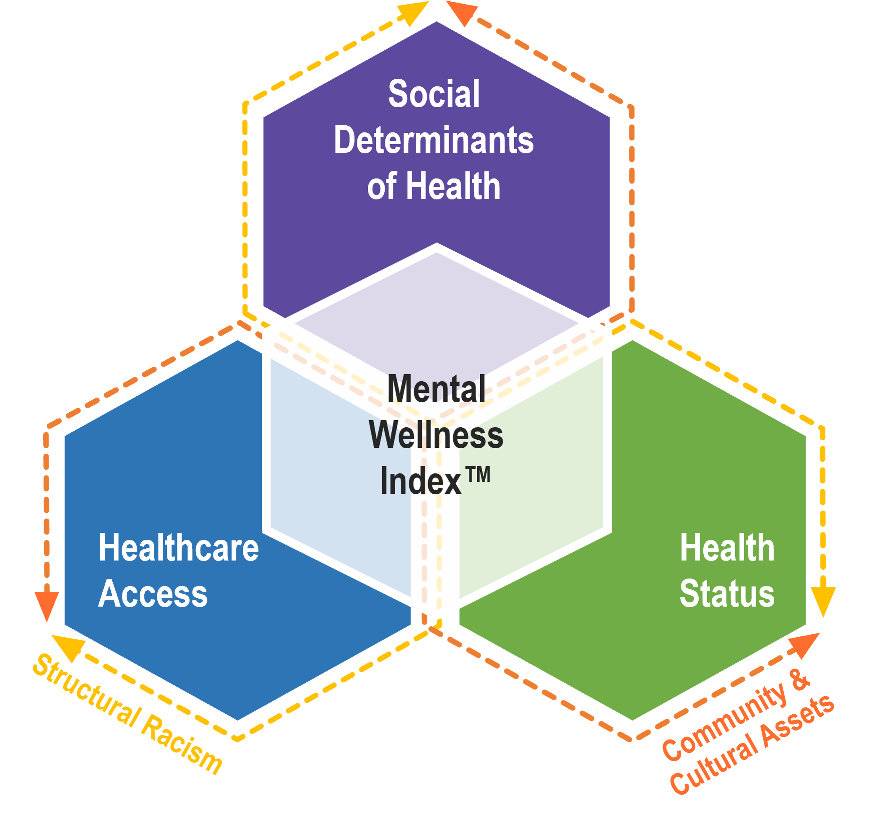

```{r setup, include=FALSE}
knitr::opts_chunk$set(echo = TRUE)
```

## Introduction

### What is the MWI

The MWI aggregates quantitative measures of the factors that influence community-level mental wellness into a single composite index at the ZIP code* level. The index takes into account that community mental wellness is shaped by many factors; not only health status itself, but also social determinants of health (which can support or provide obstacles to mental wellness), and access to healthcare (which impacts the ability of community members to receive care). The MWI framework also acknowledges the impacts of both community and cultural assets (which can enhance mental wellness) and structural racism (which provides obstacles to mental wellness). The influence of these two factors can be seen throughout the measures used to calculate the index. The MWI is currently available for both the overall population and the Black population. 

<sup>* ZIP Code Tabulation Areas (ZCTAs) are used in the Mental Wellness Index and are represented in maps and plots. ZCTAs are statistical entities that are analogous to ZIP Codes used by the United States Postal Service (USPS) for mail delivery routes. In most cases the ZCTA code is the same as the USPS ZIP code for an area. For more information on ZCTAs, please see https://www.census.gov/programs-surveys/geography/guidance/geo-areas/zctas.html. </sub>

### Purpose of the MWI

We built the Mental Wellness Index™ (MWI) to provide a tool that the nation can use to address the shadow epidemic of mental health and substance use issues emerging as a result of the COVID-19 pandemic. The MWI is intended to be a tool that community leaders, public health officials, and funding entities can use to support data-informed policy decisions about equitable allocation of resources to address mental wellness.  

The MWI is not intended to be a comprehensive evaluation of a community’s mental wellness. Currently, the MWI does not include some factors that influence mental wellness, such as social cohesion and location of non-traditional mental health service providers, due to lack of data availability (see more on this in the section on Limitations below). We recommend use of the MWI in conjunction with local data and working alongside community groups in order to identify, account for, and include local level factors that shape community mental wellness.  

### Our Focus on the Black Population

Development of the MWI started with the Black population as a priority population, then the tool was expanded to the general population. Our use of the Black population as a priority population provides a use case for using a social justice perspective and considering equity throughout the lifecycle of a project. Even though Black Americans have the same or lower prevalence of adverse mental health and substance use outcomes,^[Breslau, J., Aguilar-Gaxiola, S., Kendler, K. S., Su, M., Williams, D., & Kessler, R. C. (2006). Specifying race-ethnic differences in risk for psychiatric disorder in a USA national sample. Psychological medicine, 36(1), 57–68. https://doi.org/10.1017/S0033291705006161] ^[Breslau, J., Kendler, K. S., Su, M., Gaxiola-Aguilar, S., & Kessler, R. C. (2005). Lifetime risk and persistence of psychiatric disorders across ethnic groups in the United States. Psychological medicine, 35(3), 317–327. https://doi.org/10.1017/s0033291704003514] compared to White Americans, they often suffer worse consequences and are provided poorer access to and quality of care.^[Mental Health America. (2020). Black and African American communities and mental health. Mental Health America. https://www.mhanational.org/issues/black-and-african-american-communities-and-mental-health] ^[Office of the Surgeon General (US); Center for Mental Health Services (US); National Institute of Mental Health (US). (2001). Mental Health: Culture, Race, and Ethnicity: A Supplement to Mental Health: A Report of the Surgeon General. Rockville (MD): Substance Abuse and Mental Health Services Administration (US). Chapter 3 Mental Health Care for African Americans. Available from: https://www.ncbi.nlm.nih.gov/books/NBK44251/] ^[  SAMHSA. (2020). Double jeopardy; COVID-19 and behavioral health disparities for Black and Latino communities in the U.S. https://www.samhsa.gov/sites/default/files/covid19-behavioral-health-disparities-black-latino-communities.pdf]  Moreover, recent data indicate that racial minority groups, such as Black Americans—who have borne disproportionate impacts of COVID-19 exposure, are experiencing higher rates of mental health symptoms and use of substances to cope, compared to White Americans.^[Czeisler, M.É., Lane, R.I., Petrosky, E., et al. (2020). Mental Health, Substance Use, and Suicidal Ideation During the COVID-19 Pandemic — United States, June 24–30, 2020. MMWR Morbidity and Mortality Weekly Report, 69,1049–1057. http://dx.doi.org/10.15585/mmwr.mm6932a1]  For example, in contrast to past trends, data from 2020 found that Black Americans were more likely to have seriously considered suicide in the past 30 days, compared to White Americans. Our goal is to get ahead of these emerging disparities by focusing on a population that has experienced more health disparities historically. Selecting Black Americans as a priority population guided the way we constructed the MWI framework, selected measures, and evaluated datasets to use. Data included in the MWI has been stratified by race for the Black population where possible and measures relevant to this priority population have been included in the framework where data are available. We recognize the importance of evaluating and adapting the MWI for other populations that experience health disparities and note that currently results are available in the tool for both the Black population and the overall population.

### Components of the MWI Framework

\

#### Domains

The MWI framework contains three domains that impact community wellness:
- Social Determinants of Health: the social, economic, environmental, and structural conditions that influence a community’s mental wellness and quality of life.
- Healthcare Access: access to healthcare, taking into account quality, financial and geographic accessibility, and other considerations. 
- Health Status: mental health, substance use, and other morbidity and mortality measures that are linked to mental wellness. 
The three domains interact with one another other, for example social determinants of health can impact healthcare access as well as health status, and vice versa. While several measures in the MWI could be considered to fit in multiple domains (for example, is having health insurance a social determinant of health or an aspect of healthcare access?), we have placed each measure in only one domain. However, the user is encouraged to think broadly about how measures may impact mental wellness across domains. 

#### Measures

Within the domains are 28 measures that quantify assets supporting mental wellness as well as obstacles to mental wellness. Please see the “Measures and Data Sources” section for information about the measures used in the MWI. 

#### Ecological Factors

Two important factors influence measures in all three of the domains:

**Community and Cultural Assets**: resources in the form of people, places, and organizations that promote social inclusion and improve the mental health and wellbeing of the community.

The influence of Community and Cultural Assets can be seen prominently in measures such as density of third places (locations outside of work and the home where community members can gather such as religious institutions, community centers, etc), though this factor also influences other measures throughout the framework. Community and Cultural Assets are challenging to quantify because they are often not measured in national datasets, but they deeply influence a community’s mental wellness. 

**Structural Racism**: the macrolevel systems, social forces, institutions, ideologies, and processes that interact with one another to generate and reinforce inequities among racial and ethnic groups.

Structural Racism influences measures across all domains, contributing to inequality in healthcare access, health status, and social determinants of health. The influence of Structural Racism can be seen prominently in measures such as the Index of Concentration at the Extremes (a proxy for residential segregation), but it impacts measures throughout the framework. Structural racism harms not just Black Americans and other people of color, but society as a whole. The burden of disparity plays out economically, socially, and environmentally. Structural racism creates divisions based on race and ethnicity that can contribute to lack of dialogue between Americans of varying race, perpetuating misunderstanding, “other”ing, and ultimately making it difficult to come together and solve problems with all relevant voices at the table. The 2020 census shows a proportional population-level increase in multiracial and non-white individuals.^[United States Census Bureau. (2021, August 12). Improved Race and Ethnicity Measures Reveal U.S. Population Is Much More Multiracial. The United States Census Bureau. https://www.census.gov/library/stories/2021/08/improved-race-ethnicity-measures-reveal-united-states-population-much-more-multiracial.html]  

### How is the MWI Calculated?

The MWI is calculated for each ZIP Code Tabulation Area (ZCTA) in the country (except for ZCTAs with too much missing data to calculate a MWI value). ZCTAs are statistical entities developed by the United States Census Bureau and are generalized areal representations of the ZIP Code services areas used by the United States Postal Service (USPS) for mail delivery routes. In most cases the ZCTA code is the same as the USPS ZIP code for an area.

The MWI for a ZCTA is calculated multiplying the percentile ranked value of each of the 28 measures in that ZCTA by the weight assigned to each measure, then summing these resulting values as shown in the equation below where m designates a measure. See the [Weighting Methodology (link)] document for more information about measure weights, including how placeholder weights have been assigned.

MWI = $\sum_{m = 1}^{28} percentile ranked value_m * weight_m$

MWI = $\sum_{m = 1}^{28} percentile ranked value_{z,m} * weight_m$

## How to Use the MWI

### How to Use the Tool

- Interactive map and distribution visualizations
- Select population to view (either Overall population or Black population)
- Select whether you would like to view the aggregated MWI values themselves, or specific measures that contribute to the MWI. 
- Select a state to focus on.
- Select a ZCTA to focus on. 
- Hover over a ZCTA on the map or distribution to view values for that ZCTA
- Select measure weights
- Upload data 

### Recommended Uses

Communities, health departments, and the federal government as well as state and local governments may use findings from the MWI tool to: 
- Inform decisions about where resources to improve mental wellness may be most impactful
- Understand the factors that may serve as barriers to mental wellness in an area, and which types of resources may have the greatest impact (ex: new treatment facilities, improved infrastructure, police reform, etc)
- Enhance community grant applications
- Focus resources based on objective evaluation of need to support assets improve mental wellness and to remove obstacles to mental wellness. 

The MWI Index and tool should NOT be used to 
- Shouldn’t be the only tool used to allocate resources 
- Shouldn’t be used to make decisions on behalf on communities without their input
- Shouldn’t be used for program evaluation or tracking progress (point in time estimate, not to show progress over time)

## Measures and Data Sources

### Measure Selection Process

### MWI Measures

## Strengths, Limitations, and Challenges

## APPENDIX 