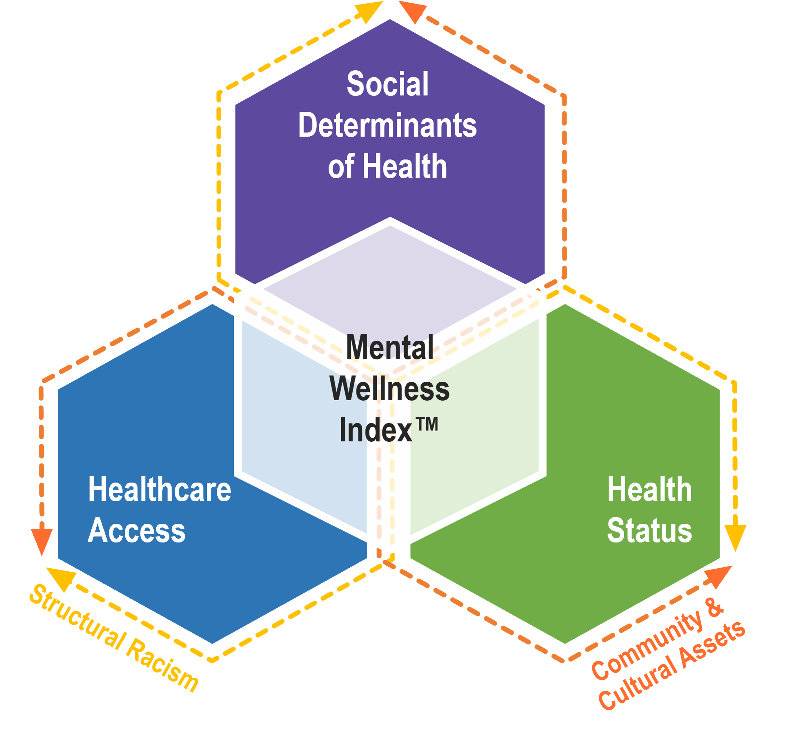
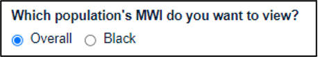
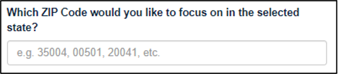
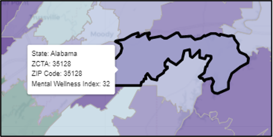
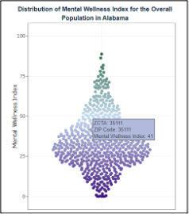
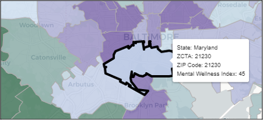

```{r setup, include=FALSE}
knitr::opts_chunk$set(echo = TRUE)
knitr::knit_hooks$set(optipng = knitr::hook_optipng)
# NOTE: once knit, move html output to www/
```

## Introduction

### What is the MWI

The Mental Wellness Index™ (MWI) quantifies factors that influence community-level mental wellness and aggregates them into a single numerical ranking at the ZIP Code* level for the entire nation. These factors act as assets or obstacles to mental wellness and are grouped into three domains: social determinants of health, healthcare access, and health status. The MWI framework also acknowledges two dynamic factors that influence mental wellness: community & cultural assets and structural racism. These two factors influence each of the measures used to calculate the index. The MWI is currently available for the overall population and for our first priority population, Black populations.  

### What Do We Mean by Mental Wellness?

Mental wellness:

* Is more than having physiological needs met, and means everyone in a community has opportunities to achieve, experience joy, have their value recognized and can actualize their self-agency and power in their environments 
* Means thriving regardless of a mental health or substance use challenge and giving everyone the opportunity to flourish^[National Council for Mental Wellbeing (n.d.) We Are Mental Wellbeing. The National Council for Mental Wellbeing. <a href = 'https://www.thenationalcouncil.org/about/we-are-mental-wellbeing/' target = "_blank">(link)</a>]

In the MWI, mental wellness is a composite of social determinants of health, healthcare access, and health status.  

### Purpose of the MWI

We built the MWI because there is no existing resource or health index to understand factors influencing mental wellness at the community level. The MWI is intended to enable local, state, and federal government agencies; non-profits; and communities to visualize the factors that contribute to mental wellness. The MWI promotes data-informed decisions and potentially more equitable allocation of resources.  

The MWI was designed with health equity in mind.^[Office of Disease Prevention and Health Promotion (2021, November 24). Healthy People 2030 Questions & Answers. Healthy People 2030.  <a href = 'https://health.gov/our-work/national-health-initiatives/healthy-people/healthy-people-2030/questions-answers#q9' target = "_blank">(link)</a>] Health equity is not linear, and the goal is not simply the attainment of a particular state. Rather, health equity must be continually re-evaluated. Health equity is both reparative and forward thinking, and does not focus only on the present state, but also root causes from the past as well as preventing future inequities.   

The MWI is not intended to be a comprehensive evaluation of a community’s mental wellness. We recommend use of the MWI in conjunction with local data and working alongside community groups to identify, account for, and include local-level factors that shape community mental wellness.   

### The MWI Framework

<center>
{width=400px}
</center>

#### Domains

The MWI framework contains three domains: 

* **Social determinants of health**: the social, economic, environmental, and structural conditions that influence a community’s mental wellness and quality of life. 

* **Healthcare access**: access to traditional healthcare systems, accounting for quality, financial, geographic, and other considerations.  

* **Health status**: mental health, substance use, and other morbidity and mortality measures that are linked to mental wellness.  

Each measure belongs to a single domain.  There are 15 measures in the social determinants of health domain, 3 measures in the healthcare access domain, and 10 measures in the health status domain.   While the domains are distinct (they do not overlap), they can influence one another. For example, the social determinants of health can influence healthcare access and health status, and vice versa. 

Please see the [Measures and Data Sources](#measures-and-data-sources) section for information about the measures in the MWI.

<a name="measures-and-data-sources"></a>

#### Dynamic Factors

Community & cultural assets and structural racism acknowledge the positive and negative influences of human factors that influence outcomes and the spatial distribution of assets and obstacles for measures in all three domains: 

**Community & cultural assets**: resources in the form of people, places, and organizations that promote social connection and improve the health and wellbeing of the community.^[Arts & Planning Toolkit. (n.d.). What is Cultural Asset Mapping? <a href = 'https://artsandplanning.mapc.org/cultural-asset-mapping/' target = "_blank">(link)</a>] ^[National Institute for Health and Care Excellence. (2017, March 3). Community engagement: improving health and wellbeing, Quality standard [QS148]. <a href = 'https://www.nice.org.uk/guidance/qs148/chapter/quality-statement-3-identifying-community-assets' target = "_blank">(link)</a>]

Community & cultural assets influence all measures in the MWI. Community & cultural assets are challenging to quantify because they are often not measured in national datasets, but they have an important influence on community mental wellness. One example of a measure where community and cultural assets can be seen prominently is Third Places, which measures the number of "Third Places," defined as places where people spend time outside of their homes (“first place”) and their workplaces (“second place”), per 100,000 people.   

**Structural racism**: the macrolevel systems, social forces, institutions, ideologies, and processes that interact with one another to generate and reinforce inequities among racial and ethnic groups.^[Gee, G., & Ford, C. (2011). Structural Racism and Health Inequities: Old Issues, New Directions. Du Bois Review: Social Science Research on Race, 8(1), 115-132. <a href = 'https://doi.org/10.1017/S1742058X11000130' target = "_blank">https://doi.org/10.1017/S1742058X11000130</a>] 

Structural racism influences all measures in the MWI. Structural racism harms society as a whole, not only Black populations and other people of color. Structural racism operates on many levels, often intersecting with other “isms” (sexism, classism, etc.) and has cascading effects that are often unnamed and seemingly unnoticed.  These cascading effects highlight the importance of our approach for developing the MWI— that equity delivered to historically marginalized populations will accrue to others and potentially catalyzes movement toward social and racial justice. One example of a measure where structural racism can be seen prominently is the Index of Concentration at the Extremes (a proxy for residential segregation). 

### How is the MWI Calculated?

The MWI is calculated for each ZIP Code* in the country. If the MWI is missing for a ZIP Code, this indicates either missing data or no population in this area. For more details, please see the project <a href = 'https://github.com/mitre/hse-mwi' target = "_blank">code</a>.  The MWI for a ZIP Code is calculated by multiplying the percentile ranked value of each of the 28 measures in that ZIP Code by the weight assigned to each measure, then summing these resulting values as shown in the equation below where m designates a measure. See the <a href = 'https://raw.githubusercontent.com/mitre/hse-mwi/main/Documentation/Methods/Weighting_Methods.pdf' target = "_blank">Weighting Methods</a> document for more information about measure weights, including how placeholder weights have been assigned. 

<!--$$MWI = \sum_{m = 1}^{28} percentile\space ranked\space value_m * weight_m$$-->
<!--replace since it looks odd in browsers-->
<center>
{width=400px}
</center>

## First Priority Population: Black Populations 

MITRE’s approach to the development, testing, and operationalization of the MWI reflects the convergence of MITRE’s Social Justice Platform (a commitment to invest in social and health equity across populations) and the concept of “centering at the margins.” In contrast to the more typical approach that centers and normalizes the experience and perspectives of White populations, “centering at the margins” prioritizes populations that have been historically underserved and under-resourced. This approach recognizes that equity delivered to historically underserved populations will accrue to others and potentially catalyzes movement toward social and racial justice. The MWI is available for both Black populations (as the initial priority population) and for the overall population (to enable broad applicability). We hope to add additional priority populations to the MWI for other groups that are experiencing health disparities.  

Even though Black populations have similar or lower prevalence of adverse mental health and substance use outcomes compared to the overall population in national datasets,^[Breslau, J., Aguilar-Gaxiola, S., Kendler, K. S., Su, M., Williams, D., & Kessler, R. C. (2006). Specifying race-ethnic differences in risk for psychiatric disorder in a USA national sample. Psychological medicine, 36(1), 57–68. <a href = 'https://doi.org/10.1017/S0033291705006161' target = "_blank">https://doi.org/10.1017/S0033291705006161</a>] ^[Breslau, J., Kendler, K. S., Su, M., Gaxiola-Aguilar, S., & Kessler, R. C. (2005). Lifetime risk and persistence of psychiatric disorders across ethnic groups in the United States. Psychological medicine, 35(3), 317–327. <a href = 'https://doi.org/10.1017/s0033291704003514' target = "_blank">https://doi.org/10.1017/s0033291704003514</a>] they often experience a greater burden of disease and poorer access to and quality of care.^[Mental Health America. (2020). Black and African American communities and mental health. Mental Health America. <a href = 'https://www.mhanational.org/issues/black-and-african-american-communities-and-mental-health' target = "_blank">(link)</a>] ^[Office of the Surgeon General (US); Center for Mental Health Services (US); National Institute of Mental Health (US). (2001). Mental Health: Culture, Race, and Ethnicity: A Supplement to Mental Health: A Report of the Surgeon General. Rockville (MD): Substance Abuse and Mental Health Services Administration (US). Chapter 3 Mental Health Care for African Americans. Available from: <a href = 'https://www.ncbi.nlm.nih.gov/books/NBK44251/' target = "_blank">(link)</a>] ^[SAMHSA. (2020). Double jeopardy; COVID-19 and behavioral health disparities for Black and Latino communities in the U.S. <a href = 'https://www.samhsa.gov/sites/default/files/covid19-behavioral-health-disparities-black-latino-communities.pdf' target = "_blank">(link)</a>]  Community and cultural assets play a critical role in bridging these gaps and advancing care delivery models beyond the scope of “traditional” health care systems.   

Black populations also experience more criminalization of mental health and substance use disorders.^[Pope, L. (2019, July 24). Racial Disparities in Mental Health and Criminal Justice. National Alliance on Mental Illness. <a href = 'https://www.nami.org/Blogs/NAMI-Blog/July-2019/Racial-Disparities-in-Mental-Health-and-Criminal-Justice' target = "_blank">(link)</a>] ^[Volkow, N.D. (2021). Addiction Should Be Treated, Not Penalized. Health Affairs Blog. <a href = 'https://www.healthaffairs.org/do/10.1377/hblog20210421.168499/full' target = "_blank">(link)</a>] Moreover, recent data indicate that racial and ethnic minority groups, such as Black populations—who have borne disproportionate impacts of COVID-19 exposure— are experiencing higher rates of mental health symptoms and use of substances to cope.^[Substance Abuse and Mental Health Services Administration. (n.d.). Double Jeopardy: COVID-19 and Behavioral Health Disparities for Black and Latino Communities in the U.S. (Submitted by OBHE). <a href = 'https://www.samhsa.gov/sites/default/files/covid19-behavioral-health-disparities-black-latino-communities.pdf' target = "_blank">(link)</a>] ^[Novacek, D. M., Hampton-Anderson, J. N., Ebor, M. T., Loeb, T. B., & Wyatt, G. E. (2020). Mental health ramifications of the COVID-19 pandemic for Black Americans: Clinical and research recommendations. Psychological trauma: theory, research, practice and policy, 12(5), 449–451. <a href = 'https://doi.org/10.1037/tra0000796' target = "_blank">https://doi.org/10.1037/tra0000796</a>] For example, in contrast to past trends, data from 2020 found that Black respondents more commonly reported increased substance use and serious consideration of suicide in the past 30 days compared to White Americans.^[Czeisler, M.É., Lane, R.I., Petrosky, E., et al. (2020). Mental Health, Substance Use, and Suicidal Ideation During the COVID-19 Pandemic — United States, June 24–30, 2020. MMWR Morbidity and Mortality Weekly Report, 69,1049–1057. <a href = 'http://dx.doi.org/10.15585/mmwr.mm6932a1' target = "_blank">http://dx.doi.org/10.15585/mmwr.mm6932a1</a>]  

Selecting Black populations as a priority population guided the way we constructed the MWI framework, selected measures, and evaluated datasets to use. MWI measures have been stratified by race for Black populations where possible.  

## How to Use the MWI Tool

The MWI tool is an interactive, web-based application that allows users to explore the MWI and its 28 measures in all ZIP Codes* in the United States, upload community-specific data (effectively add or remove measures), and customize measure weights to reflect their perspectives.  

### Interpreting the MWI and its Measures 

The MWI and its individual measures are displayed as rankings that show how a given ZIP Code compares to all other ZIP Codes in the nation on a range between 0 and 100. For example, a Broadband Access measure ranking of 75 means that this ZIP Code ranks higher than 75% of the ZIP Codes in the nation for this measure (not that 75% of individuals in the ZIP Code have broadband access).  

For both the MWI and individual measures, a higher ranking (closer to 100) indicates more assets to mental wellness, while a lower ranking (closer to 0) indicates more obstacles to mental wellness.  

The tool has two pages that can be used to explore the MWI: Explore States and Explore ZIP Codes:

### Explore States

<center>
{width=400px}
</center>

The Explore States page allows users to explore the MWI through interactive map and distribution visualizations. This page is useful if you would like to focus on a particular state or compare a ZIP Code to state-wide rankings. 

Users should:

1. Select population to view (either Overall or Black),

<center>
{width=400px}
</center>

2. Select either a specific state, or the entire country (“All” states),

<center>
{width=400px}
</center>

3. Select to explore either the overall MWI, or an individual measure.

<center>
{width=400px}
</center>

Then, users can select a ZIP Code within their selected state by either:

1. Entering the numeric ZIP Code under “Exploration Options”,

<center>
{width=400px}
</center>

2. Or by clicking on a ZIP Code on the interactive map.

<center>
{width=400px}
</center>

<br>

Users can also explore the MWI by hovering over ZIP Codes on the map, or by hovering over points on the interactive distribution. 

<center>
{height=400px}
</center>

### Explore ZIP Codes

In addition to an interactive map, the Explore ZIP Codes page provides a community overview that shows the MWI and each individual measure for a specified ZIP Code. This page is useful to see all measures for a ZIP Code, or to focus on areas (which may cross state lines) surrounding a ZIP Code.

<center>
{width=400px}
</center>

Users should:

1.	Select population to view (either Overall or Black),

<center>
{width=400px}
</center>

2.	Select to explore either the overall MWI, or an individual measure, and 

<center>
{width=400px}
</center>

3. Enter a numeric ZIP Code under “Exploration Options”.

<center>
{width=400px}
</center>

Then, users can explore further by hovering their mouse over ZIP Codes on the map.

<center>
{width=400px}
</center>

<br>

Additionally, the Create Your Own MWI page can be used to upload custom data, or to adjust measure weights. Instructions can be found by clicking on the Create Your Own MWI tab. 

## Measures and Data Sources

### Measure Selection Process

To select measures to include in the MWI, we leveraged data and expertise from existing MITRE projects and work; researched factors associated with mental wellness based on national and community studies; and engaged with external subject matter experts, funding organizations, and potential users. 

**Measure selection requirements**: selected measures were limited to topics for which nationally available, public data are available at a geographically granular level (ideally the ZIP Code level or lower).

Though race stratified data are not available for all measures in the MWI, preference was given in the selection process to measures with data that can be stratified by race for Black populations. For data that is stratified by Black populations, the measure is calculated for both Black populations and the overall population (see <a href = 'https://github.com/mitre/hse-mwi/tree/main/Documentation/Measures' target = "_blank">measure documentation</a> for more information on these calculations). For data that cannot be stratified, the overall population values are used for both calculations. Some measures that strongly aligned with the measure evaluation and selection criteria (see below) were included even though they could not be stratified by race. 

**Measure evaluation and selection criteria** that were considered during measure selection are shown below: 

* __Equity__: Does the measure capture inequities between populations, value group differences, and build on best science and community experience without introducing bias? Is the measure in line with a “do-no-harm” approach?

* __Importance__: IIs the measure an important indicator of mental wellness, supported by a consensus of evidence in literature? 

* __Relevance and Usability__: Is information produced by the measure meaningful, understandable, and useful for decision-making? Does it convey a sense of the obligation to act? 

* __Scientific Soundness__: What is the measure’s sensitivity, specificity, reliability, and validity? 

* __Feasibility__: What is the measure collection burden? How frequently are data updated, and are they available on a timely basis? 

### MWI Measures

The table below summarizes the measures that are included in the MWI, their domain (and sub-domain), whether race-stratified data are available, and the data sources. Please see the <a href = 'https://github.com/mitre/hse-mwi/tree/main/Documentation/Measures' target = "_blank">measure documentation</a> for more information about each measure. For stratification, “N/A” signifies that race stratification was not applicable for the measure, while “No” signifies that race stratified data was not available for the measures. 

| **Measure Name** | **Domain** | **Sub-Domain** | **Stratification** | **Data Source** |
|:---:|:---:|:---:|:---:|:---:|
| Access to Financial Services | <span style="color:#5d499e">SDOH</span> | Financial Access | Not Applicable | New America, Mapping Financial Opportunity Project |
| Alcohol Outlet Density | <span style="color:#5d499e">SDOH</span> | Built Environment | Not Applicable | CBP |
|Below 100% Federal Poverty Level|<span style="color:#5d499e">SDOH</span> |Income & Employment|Black Populations|ACS|
|Broadband Access|<span style="color:#5d499e">SDOH</span> |Built Environment|Black Populations|ACS|
|Housing Stress|<span style="color:#5d499e">SDOH</span> |Housing|Black Populations|HUD CHAS|
|Living Within a Half-Mile of a Park|<span style="color:#5d499e">SDOH</span> |Built Environment|Not Applicable|CDC Environmental Public Health Tracking Network|
|Mortgage Acceptance Rate|<span style="color:#5d499e">SDOH</span> |Financial Access|Black Populations|HMDA, Consumer Financial Protection Bureau|
|No High School Diploma|<span style="color:#5d499e">SDOH</span> |Education|Black Populations|ACS|
|Nursery and Preschool Enrollment|<span style="color:#5d499e">SDOH</span> |Education|Black Populations|ACS|
|Police Killings|<span style="color:#5d499e">SDOH</span> |Safety & Community Trauma|Black Populations|Mapping Police Violence|
|Residential Segregation|<span style="color:#5d499e">SDOH</span> |Housing|Black Populations|ACS|
|Third Places|<span style="color:#5d499e">SDOH</span> |Social Capital|Not applicable|CBP|
|Unemployment|<span style="color:#5d499e">SDOH</span> |Income & Unemployment|Black Populations|ACS|
|Violent Crime|<span style="color:#5d499e">SDOH</span> |Safety & Community Trauma|Not available|County Health Rankings|
|Voter Participation|<span style="color:#5d499e">SDOH</span> |Social Capital|Not Available|TBD|
|Mental Health Treatment Facility Access|<span style="color:#70ad47">Healthcare Access</span>|Treatment Facilities|Not applicable|SAMHSA Behavioral Health Treatment Services Locator
|Substance Use Treatment Facility Access|<span style="color:#70ad47">Healthcare Access</span>|Treatment Facilities|Not applicable|SAMHSA Behavioral Health Treatment Services Locator|
|Uninsured|<span style="color:#70ad47">Healthcare Access</span>|Health Insurance|Black Populations|ACS|
|Adult Binge Drinking|<span style="color:#157ba7">Health Status</span>|Substance Use|Not available|CDC BRFSS, PLACES|
|Alcohol-Related Mortality|<span style="color:#157ba7">Health Status</span>|Substance Use|Black Populations|CDC WONDER
|Estimated Drug Poisoning|<span style="color:#157ba7">Health Status</span>|Substance Use|Black Populations|CDC WONDER|
|Insufficient Sleep|<span style="color:#157ba7">Health Status</span>|Other Morbidity & Mortality|Not available|CDC BRFSS, PLACES|
|Life Expectancy|<span style="color:#157ba7">Health Status</span>|Other Morbidity & Mortality|Black Populations (extrapolated)|CDC USALEEP, NVSS|
|Obesity|<span style="color:#157ba7">Health Status</span>|Other Morbidity & Mortality|Not Available|CDC BRFSS, PLACES Data Portal|
|Poor Mental Health|<span style="color:#157ba7">Health Status</span>|Mental Health|Not Available|CDC BRFSS, PLACES|
|Smoking Status|<span style="color:#157ba7">Health Status</span>|Substance Use|Not available|CDC BRFSS, PLACES|
|Suicidal Ideation|<span style="color:#157ba7">Health Status</span>|Mental Health|Not Available|NSDUH|
|Suicide Mortality|<span style="color:#157ba7">Health Status</span>|Mental Health|Black Populations|CDC WONDER|
_Notes_:

- ACS – American Community Survey

- BRFSS – Behavioral Risk Factor Surveillance System 

- CBP – County Business Patterns

- CDC – Centers for Disease Control 

- CHAS – Consolidated Planning/Comprehensive Housing Affordability Strategy

- HMDA – Home Mortgage Disclosure Act

- HUD – Housing and Urban Development

- NSDUH – National Survey on Drug Use and Health 

- SAMHSA – Substance Abuse and Mental Health Services Administration

- WONDER – Wide-ranging Online Data for Epidemiologic Research

<br>

The table below summarizes the years and geographic levels for the data sources used. For information on how measures with data available at various geographic levels were processed, see the <a href = "https://github.com/mitre/hse-mwi/raw/main/Documentation/Methods/Geography_Methods.pdf" target = "_blank">Geography Methods</a> document. 

| **Data Source Name** | **Year(s)** | **Source Geographic Levels** |
|:---:|:---:|:---:|
|American Community Survey (ACS)|2015-2019|ZIP Code Tabulation Area (ZCTA)|
|Centers for Disease Control and Prevention (CDC) Behavioral Risk Factor Surveillance System (BRFSS), accessed via the PLACES Project Data Portal|2018|ZIP Code Tabulation Area (ZCTA)|
|Centers for Disease Control and Prevention (CDC) U.S. Small-area Life Expectancy Estimates Project (USALEEP)|2010-2015|Census Tract
|Centers for Disease Control and Prevention (CDC) National Environmental Public Health (EPH), Tracking Network Query Tool|2015|Census Tract|
|Centers for Disease Control and Prevention (CDC) Wide-ranging Online Data for Epidemiologic Research (WONDER)|2010-2019|County|
|County Business Patterns (CBP)|2019|ZIP Code, County|
|County Health Rankings|2014, 2016, 2017-2019|County|
|Home Mortgage Disclosure Act (HMDA) Dataset, Consumer Financial Protection Bureau|2020|ZIP Code Tabulation Area (ZCTA)|
|Mapping Police Violence|2015-2019|ZIP code|
|New America, Mapping Financial Opportunity (MFO) Project|2019, 2021|County|
|Interactive National Survey on Drug Use and Health (NSDUH) Substate Estimates|2016-2018|Substate Region|
|Substance Abuse and Mental Health Services Administration (SAMHSA), Behavioral Health Treatment Services Locator|2021 (as of May 18)|	Latitude/Longitude|
|United States Department of Housing and Urban Development, Consolidated Planning/Comprehensive Housing Affordability Strategy (CHAS)	|2013-2017|Census Tract

## Recommended Uses

Recommended uses for the MWI include: 

*	**For policy makers**: Inform decisions about resource allocation, including selecting which resources may be most impactful for improving mental wellness.
*	**For communities and community leaders**: Provide a community dashboard of factors that influence mental wellness and focus points for interventions and resources. 
*	**For funders**: Provide a resource for grantmaking across standardized factors for both applicant communities and funders. *	**For researchers**: Provide an index focused on mental wellness to deepen understanding of assets and barriers in communities. 

The MWI should not be used:

*	As the only tool used to allocate resources,
*	To make decisions on behalf on communities without their input, or
*	For program evaluation or tracking progress over time (because the MWI provides point in time data and does not contain time series data to show progress over time).


## Strengths, Limitations, and Challenges

__Strengths__ of the MWI include the following:

- <u>The MWI fills a gap</u> - There is no existing tool that summarizes the factors influencing mental wellness of communities for the entire nation at a geographically granular level (such as the ZIP Code level). The MWI fills this gap. 

- <u>A focus on equity</u> by embedding equity focused language into the MWI framework through the dynamic factors of structural racism and community and cultural assets. In creating a tool meant to support decision-makers and equitable allocation of resources to improve mental wellness outcomes, we acknowledge that it is essential to address the role of structural racism and disinvestment in people and communities, which have led to the accumulation of obstacles that hinder mental wellness. Nevertheless, our focus on including community & cultural assets within the framework seeks to make explicit the strengths, identities, and aspirations that individuals and communities hold about themselves that promote mental wellness.

- <u>Adjustable and modifiable for various use cases</u>. The MWI allows users to modify the index by either uploading their own local or use-case specific data, and by adjusting the placeholder weights based on their preferences, use case, or priorities. The measures and overall MWI calculation can be viewed for both Black populations and the overall population. 

- <u>Objective, data-based dashboard</u> of the factors that influence mental well-being allows for a “like to like” comparison of areas and can help inform users (in partnership with impacted communities) about how best to distribute resources for the highest impact, and to advocate for their communities. The MWI can provide valuable information to communities, public health practitioners, government agencies, and funders seeking to improve or understand community mental wellness. 

__Limitations__ of the MWI: 

<u>Limited by challenges in data availability</u>. Limitations that we faced based on the types of data that are available and collected in national datasets include the following:

- Lack of access to geographically granular data on certain topics

- Lack of data stratified by demographics such as race, ethnicity, sexual orientation, English proficiency/language, etc. 

- Most data are deficit-focused, and deficit-focused data may not represent community-based perspectives and lack a focus on assets and strengths.

 - Impact of structural racism inherent to the research enterprise, which impacts areas such as survey development, sampling, data collection and analysis, etc.
 
- Some populations, such as individuals experiencing homelessness, may not be represented in various national datasets

Because data were aggregated from multiple data sources, we note that all data are not from the same year or range of years. Additionally, some measures that strongly aligned with the measure evaluation and selection criteria (see below) were included even though they could not be stratified by race, so calculations based on these measures may have lower validity for Black populations. Race stratified data were available for 14 measures, unavailable for 8 measures, and not applicable for 6 measures.

Nationally representative, geographically granular data were unavailable for a wide range of topics that impact mental wellness, such as social connectedness^[Office of Disease Prevention and Health Promotion (n.d.). Social Cohesion. Healthy People 2030. <a href = "https://health.gov/healthypeople/objectives-and-data/social-determinants-health/literature-summaries/social-cohesion" target = "_blank">(link)</a>];  sense of belonging; access to safe, reliable, and efficient transportation; community allostatic load^[Chandra, A., Cahill, M., Yeung, D., and Ross,R. (2018) Toward an Initial Conceptual Framework to Assess Community Allostatic Load: Early Themes from Literature Review and Community Analyses on the Role of Cumulative Community Stress. RAND Corporation. Available at: <a href = "https://www.rand.org/pubs/research_reports/RR2559.html" target = "_blank">(link)</a>];  and access to culturally and linguistically appropriate care, among others. If data on these, or other topics, are available at the local level, using the MWI tool data upload feature can enhance the results of the MWI. 

<u>We had a limited ability to consult directly with communities in the creation of the MWI</u>. Input from communities that are directly impacted is vital to ensure a tool will be most useful for them. While we consulted with and had input from selected community leaders and program providers in Black communities, we did not have direct input from community residents. In our next steps, we hope to engage directly with communities to understand their priorities and preferences, incorporate participatory approaches, and work with communities to understand how the MWI can best address their needs. 

<u>We have sought to address these challenges by</u>:

- Prioritizing race-stratified measures. 
- Building adaptive features into the MWI tool that allow users to upload community-specific data (effectively adding and removing measures), and weight measures according to their values and preferences.
- Incorporating creative measure constructs by including measures of assets that are not “traditionally” included in health indices (e.g., third places, access to financial services, voter participation, etc.), and application of novel methodologies to represent key constructs (e.g., using data about treatment facility characteristics in addition to location data). 
- Committing to document and share recommendations related to challenges with others to positively influence change.

Please see <a href = 'https://github.com/mitre/hse-mwi/tree/main/Documentation/Measures' target = "_blank">measure documentation</a> for more information on the strengths and limitations of specific measures selected. 

## Validity Testing

Analytic and face validity verification is in progress to evaluate the robustness, validity, and accuracy of the MWI. As part of the analytic validity testing, the team will examine the correlation of the MWI with other major health indices, such as the Social Vulnerability Index, County Health Rankings, the Health Resources and Service Administration's Service Area Status, and others.  To test its face validity, listening sessions will be held with community key informants and others to solicit feedback on ways to improve the MWI and the MWI tool to increase its validity and usefulness.  The MWI team will update this page with results as they become available.

## Downloadable Data and Information

- <a href = 'https://github.com/mitre/hse-mwi/blob/main/Data/Cleaned/HSE_MWI_Data_Information.csv' target = "_blank">Data Information</a>: The document delineates all measures and key facets for each measure such as the data source, weight, year(s) extracted, geographic level, and directionality.
- <a href = 'https://github.com/mitre/hse-mwi/raw/main/Data/Cleaned/HSE_MWI_ZCTA_Mental_Wellness_Index_Black.csv' target = "_blank">Mental Wellness Index for Black Populations</a>: The calculated MWI for Black populations for each ZCTA.
- <a href = 'https://github.com/mitre/hse-mwi/raw/main/Data/Cleaned/HSE_MWI_ZCTA_Mental_Wellness_Index_Population.csv' target = "_blank">Mental Wellness Index for Overall Population</a>: The calculated MWI for the overall population for each ZCTA.
- <a href = 'https://github.com/mitre/hse-mwi' target = "_blank">MWI Project Github Page</a>: This page is home to all of the raw data, code to manipulate the data, documentation concerning each measures, and everything else concerned with the creation of the MWI Tool.

## Acknowledgements and Contact Information
We would like to acknowledge the following team members, advisors, and reviewers/contributors that helped to create the MWI.

<u>Team members </u>:

- Lynne Cuppernull
- Hannah De los Santos
- Stacie DeRamus
- Emilie Gilde
- Karen Jiang
- Hannah Leker
- Danyelle Mannix 
- Caroline Mills
- Emily Pantalone
- Mitch Strahlman

<u>Key advisors</u>:

- Larke Huang 
- Cassandra Okechukwu
- Jenine Patterson
- Erica Taylor 

<u>Reviewers/Contributors</u>: 

- Robert Staubs 
- Chris Teixeira 
- Brooke Wilkens 
- Tori Mudd
- Elizabeth Murphy
- Sarah Ober and the Case Study for Health Equity in Population Health MIP team

We would also like to extend our gratitude to the many other external organizations, community key informants, and individuals that contributed their time to discussing, reviewing, and providing feedback for the MWI. 

For more information about the MWI, please contact the MITRE Social Justice Platform at socialjustice@mitre.org.

*Note – In this document, the term “ZIP code” refers to ZIP Code Tabulation Areas (ZCTAs), which are used in the Mental Wellness Index and are represented in maps and plots. ZCTAs are statistical entities that are analogous to ZIP Codes used by the United States Postal Service (USPS) for mail delivery routes. In most cases the ZCTA code is the same as the USPS ZIP code for an area. For more information on ZCTAs, please see <a href = 'https://www.census.gov/programs-surveys/geography/guidance/geo-areas/zctas.html' target = "_blank">census.gov</a>.


