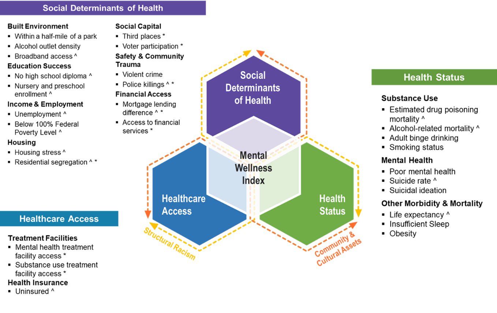

```{r setup, include=FALSE}
knitr::opts_chunk$set(echo = TRUE)
knitr::knit_hooks$set(optipng = knitr::hook_optipng)
# NOTE: ADD REFERENCES TO MEASURES LATER

```

<blockquote class="focus">

The driving force behind the MWI is that equity delivered to historically marginalized populations will accrue to others and potentially catalyze movement toward social and racial justice.

</blockquote>

::: {style="top: 0px; padding: 10px"}
\
:::

> **Note**: Measures marked with an (\*) indicate novel measure/method used, and measures marked by a (\^) indicate that the measure is available stratified for Black Populations

The MWI framework contains three domains and two dynamic factors:

-   Domains:
    -   Social Determinants of Health
    -   Healthcare Access
    -   Health Status
-   Dynamic Factors
    -   Structural Racism
    -   Community and Cultural Assets

### Domains and Sub-Domains

The three domains in the MWI framework are: Social Determinants of Health, Healthcare Access, and Health Status. These are distinct and influence one another (they do not overlap). Each domain includes a set of measures, each measure belongs to a single domain.

#### Social Determinants of Health
1.  **Social Determinants of Health:** the social, economic, environmental, and structural conditions that influence a community's mental wellness and quality of life.[^1] There are 15 measures in this domain, organized under the following sub-domains:
    -   **Built Environment:** The physical parts of where people live and work, such as easy access to parks and having broadband access.[^2]
    -   **Education Success:** Ability to receive formal education and to achieve graduation outcomes.
    -   **Income & Employment:** Income earned in comparison to the federal poverty level and employment status.[^3]
    -   **Housing:** Living space affordability, quality, and economic and racial/ethnic spatial polarization.
    -   **Social Capital:** Refers to the resources to which individuals and groups have access through their social networks. These social networks could be at the personal, public, professional, and other levels. When these networks intersect the value of these connections increases, increasing the overall social capital.[^4]
    -   **Safety and Community Trauma:** Safety refers to factors contributing to community members living in peace, harmony, and mutual respect,[^5] while community trauma refers to experiences by community members that have structural and social traumatic consequences.[^6]
    -   **Financial Access:** Availability and affordability of financial services for individuals in a community.[^7] <br>
    
#### Healthcare Access
2.  **Healthcare Access:** Access to traditional healthcare systems, accounting for quality, financial, geographic, and other considerations. There are 3 measures in this domain, organized under the following sub-domains:
    -   **Treatment Facilities:** Access to physical locations providing appropriate medical treatment.
    -   **Health Insurance:** Service covering some or all health and medical costs. <br>
    
#### Health Status
3.  **Health Status:** mental health, substance use, and other morbidity and mortality measures that are linked to mental wellness. There are 10 measures in this domain, organized under the following sub-domains:
    -   **Substance Use:** Mortality from and frequency of substance use behaviors at a community level.
    -   **Mental Health:** Emotional, psychological, and social well-being of communities.[^8]
    -   **Other Morbidity and Mortality:** Other forms of morbidity and mortality correlated with mental wellness. <br>

[^1]: Giesbrecht, N., Huguet, N., Ogden, L., Kaplan, M. S., McFarland, B. H., Caetano, R., Conner, K. R., & Nolte, K. B. (2015). Acute alcohol use among suicide decedents in 14 US states: impacts of off-premise and on premise alcohol outlet density. Addiction, 110(2), 300--307.. <a href = 'https://doi.org/10.1111/add.12762 ' target = "_blank">(link)</a>

[^2]: Pereira, G., Wood, L., Foster, S., & Haggar, F. (2013). Access to alcohol outlets, alcohol consumption and mental health. PLOS One, 8(1), Article e53461. <a href = 'https://doi.org/10.1371/journal.pone.0053461' target = "_blank">(link)</a>

[^3]: Health Resources and Services Administration, Office of Health Equity. (2020). Health Equity Report 2019-2020: Special Feature on Housing and Health Inequalities. U.S. Department of Health and Human Services. <a href = 'https://www.hrsa.gov/sites/default/files/hrsa/health-equity/HRSA-health-equity-report.pdf' target = "_blank">(link)</a>

[^4]: Conroy, T., Deller, S., Kures, M., Low, S., Glazer, J., Huyke, G., & Stark, C. (2021). Broadband and the Wisconsin Economy. Division of Extension EDA University Center at University of Wisconsin-Madison. <a href = 'https://economicdevelopment.extension.wisc.edu/files/2021/01/2021-01-07-Broadband-Report.pdf' target = "_blank">(link)</a>

[^5]: Benda, N. C., Veinot, T. C., Sieck, C. J., & Ancker, J. S. (2020). broadband internet access is a social determinant of health! American Journal of Public Health, 110(8), 1123--1125. <a href = 'https://doi.org/10.2105/ajph.2020.305784' target = "_blank">(link)</a>

[^6]: Tomer, A., Fishbane, L., Siefer, A., & Callahan, B. (2020). Digital Prosperity: How broadband can deliver health and equity to all communities. Brookings Metropolitan Policy Program. <a href = 'https://www.brookings.edu/wpcontent/uploads/2020/02/20200227_BrookingsMetro_Digital-Prosperity-Report-final.pdf ' target = "_blank">(link)</a>

[^7]: Balseviciene, B., Sinkariova, L., Grazuleviciene, R., Andrusaityte, S., Uzdanaviciute, I., Dedele, A., & Nieuwenhuijsen, M. J. (2014). *Impact of residential greenness on preschool children's emotional and behavioral problems.* International Journal of Environmental Research and Public Health, 11(7), 6757--6770. <https://doi.org/10.3390/ijerph110706757>{target="_blank"}

[^8]: Mitchell, R. J., Richardson, E. A., Shortt, N. K., & Pearce, J. R. (2015). *Neighborhood environments and socioeconomic inequalities in mental well-being.* American Journal of Preventive Medicine, 49(1), 80--84. <https://doi.org/10.1016/j.amepre.2015.01.017>{target="_blank"}

### Dynamic Factors

*Community & Cultural Assets* and *Structural Racism* acknowledge the positive and negative influences of human factors that influence outcomes and the distribution of assets and obstacles for measures in all three domains:

#### Community & Cultural Assets 
**Community & Cultural Assets** are resources in the form of people, places, and organizations that promote social connection and improve the health and wellbeing of the community.[^9] [^10]

[^9]: Sturm, R., & Cohen, D. (2014). *Proximity to urban parks and mental health.* The Journal of Mental Health Policy and Economics, 17(1), 19--24. <https://www.ncbi.nlm.nih.gov/pmc/articles/PMC4049158/>{target="_blank"}

    Sturm, R., & Cohen, D. (2014). *Proximity to urban parks and mental health.* The Journal of Mental Health Policy and Economics, 17(1), 19--24. <https://www.ncbi.nlm.nih.gov/pmc/articles/PMC4049158/>{target="_blank"}

    Sturm, R., & Cohen, D. (2014). *Proximity to urban parks and mental health.* The Journal of Mental Health Policy and Economics, 17(1), 19--24. <https://www.ncbi.nlm.nih.gov/pmc/articles/PMC4049158/>{target="_blank"}

[^10]: Esch, P., Bocquet, V., Pull, C., Couffignal, S., Lehnert, T., Graas, M., Fond-Harmant, L., & Ansseau, M. (2014). *The downward spiral of mental disorders and educational attainment: a systematic review on early school leaving.* BMC Psychiatry, 14, Article 237. <https://doi.org/10.1186/s12888-014-0237-4>{target="_blank"}

Community & cultural assets influence all measures in the MWI. Community & cultural assets are challenging to quantify because they are often not measured in national datasets, but they have an important influence on community mental wellness. One example of a measure where community and cultural assets can be seen prominently is "third places," which measures the number of places where people spend time outside of their homes ("first place") and their workplaces ("second place"), per 100,000 people.


#### Structural Racism
**Structural Racism** is the macrolevel systems, social forces, institutions, ideologies, and processes that interact with one another to generate and reinforce inequities among racial and ethnic groups.[^11]

[^11]: Steele, L. S., Dewa, C. S., Lin, E., & Lee, K. L. (2007). *Education level, income level and mental health services use in Canada: associations and policy implications.* Healthcare Policy, 3(1), 96--106. <https://www.ncbi.nlm.nih.gov/pmc/articles/PMC2645130/>{target="_blank"}

Structural racism influences all measures in the MWI. Structural racism harms society as a whole, not only Black populations and other people of color. Structural racism operates on many levels, often intersecting with other "isms" (sexism, classism, etc.) and has cascading effects that are often unnamed and seemingly unnoticed. These cascading effects highlight the importance of our approach for developing the MWI---that equity delivered to historically marginalized populations will accrue to others and potentially catalyzes movement toward social and racial justice. One example of a measure where structural racism can be seen prominently is the Index of Concentration at the Extremes (a proxy for residential segregation).
