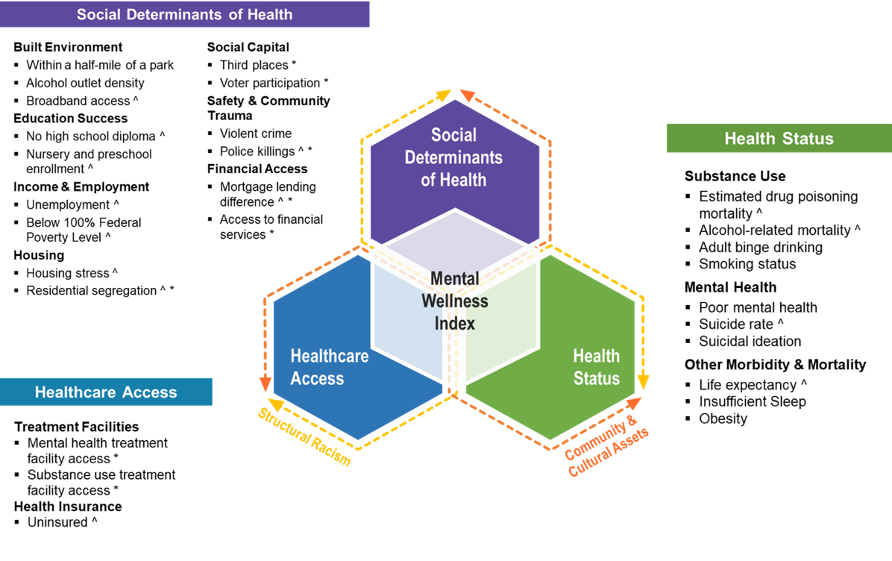

```{r setup, include=FALSE}
knitr::opts_chunk$set(echo = TRUE)
knitr::knit_hooks$set(optipng = knitr::hook_optipng)
# NOTE: ADD REFERENCES TO MEASURES LATER

```

## MWI Framework

<blockquote class="focus">

The driving force behind the MWI is that equity delivered to historically marginalized populations will accrue to others and potentially catalyze movement toward social and racial justice.

</blockquote>

::: {style="top: 0px; padding: 10px"}
\
:::

The MWI framework contains three domains and two dynamic factors:

-   Domains:
    -   Social Determinants of Health
    -   Healthcare Access
    -   Health Status
-   Dynamic Factors
    -   Structural Racism
    -   Community and Cultural Assets

### Domains and Sub-Domains

The three domains in the MWI framework are: Social Determinants of Health, Healthcare Access, and Health Status. These are distinct and influence one another (they do not overlap). Each domain includes a set of measures, each measure belongs to a single domain.

1.  **Social Determinants of Health:** the social, economic, environmental, and structural conditions that influence a community's mental wellness and quality of life.[^1] There are 15 measures in this domain, organized under the following sub-domains:
    -   **Built Environment:** The physical parts of where people live and work, such as easy access to parks and having broadband access.[^2]
    -   **Education Success:** Ability to receive formal education and to achieve graduation outcomes.
    -   **Income & Employment:** Income earned in comparison to the federal poverty level and employment status.[^3]
    -   **Housing:** Living space affordability, quality, and economic and racial/ethnic spatial polarization.
    -   **Social Capital:** Refers to the resources to which individuals and groups have access through their social networks. These social networks could be at the personal, public, professional, and other levels. When these networks intersect the value of these connections increases, increasing the overall social capital.[^4]
    -   **Safety and Community Trauma:** Safety refers to factors contributing to community members living in peace, harmony, and mutual respect,[^5] while community trauma refers to experiences by community members that have structural and social traumatic consequences.[^6]
    -   **Financial Access:** Availability and affordability of financial services for individuals in a community.[^7] <br>
2.  **Healthcare Access:** Access to traditional healthcare systems, accounting for quality, financial, geographic, and other considerations. There are 3 measures in this domain, organized under the following sub-domains:
    -   **Treatment Facilities:** Access to physical locations providing appropriate medical treatment.
    -   **Health Insurance:** Service covering some or all health and medical costs. <br>
3.  **Health Status:** mental health, substance use, and other morbidity and mortality measures that are linked to mental wellness. There are 10 measures in this domain, organized under the following sub-domains:
    -   **Substance Use:** Mortality from and frequency of substance use behaviors at a community level.
    -   **Mental Health:** Emotional, psychological, and social well-being of communities.[^8]
    -   **Other Morbidity and Mortality:** Other forms of morbidity and mortality correlated with mental wellness. <br>

[^1]: Giesbrecht, N., Huguet, N., Ogden, L., Kaplan, M. S., McFarland, B. H., Caetano, R., Conner, K. R., & Nolte, K. B. (2015). Acute alcohol use among suicide decedents in 14 US states: impacts of off-premise and on premise alcohol outlet density. Addiction, 110(2), 300--307.. <a href = 'https://doi.org/10.1111/add.12762 ' target = "_blank">(link)</a>

[^2]: Pereira, G., Wood, L., Foster, S., & Haggar, F. (2013). Access to alcohol outlets, alcohol consumption and mental health. PLOS One, 8(1), Article e53461. <a href = 'https://doi.org/10.1371/journal.pone.0053461' target = "_blank">(link)</a>

[^3]: Health Resources and Services Administration, Office of Health Equity. (2020). Health Equity Report 2019-2020: Special Feature on Housing and Health Inequalities. U.S. Department of Health and Human Services. <a href = 'https://www.hrsa.gov/sites/default/files/hrsa/health-equity/HRSA-health-equity-report.pdf' target = "_blank">(link)</a>

[^4]: Conroy, T., Deller, S., Kures, M., Low, S., Glazer, J., Huyke, G., & Stark, C. (2021). Broadband and the Wisconsin Economy. Division of Extension EDA University Center at University of Wisconsin-Madison. <a href = 'https://economicdevelopment.extension.wisc.edu/files/2021/01/2021-01-07-Broadband-Report.pdf' target = "_blank">(link)</a>

[^5]: Benda, N. C., Veinot, T. C., Sieck, C. J., & Ancker, J. S. (2020). broadband internet access is a social determinant of health! American Journal of Public Health, 110(8), 1123--1125. <a href = 'https://doi.org/10.2105/ajph.2020.305784' target = "_blank">(link)</a>

[^6]: Tomer, A., Fishbane, L., Siefer, A., & Callahan, B. (2020). Digital Prosperity: How broadband can deliver health and equity to all communities. Brookings Metropolitan Policy Program. <a href = 'https://www.brookings.edu/wpcontent/uploads/2020/02/20200227_BrookingsMetro_Digital-Prosperity-Report-final.pdf ' target = "_blank">(link)</a>

[^7]: Balseviciene, B., Sinkariova, L., Grazuleviciene, R., Andrusaityte, S., Uzdanaviciute, I., Dedele, A., & Nieuwenhuijsen, M. J. (2014). *Impact of residential greenness on preschool children's emotional and behavioral problems.* International Journal of Environmental Research and Public Health, 11(7), 6757--6770. <https://doi.org/10.3390/ijerph110706757>

[^8]: Mitchell, R. J., Richardson, E. A., Shortt, N. K., & Pearce, J. R. (2015). *Neighborhood environments and socioeconomic inequalities in mental well-being.* American Journal of Preventive Medicine, 49(1), 80--84. <https://doi.org/10.1016/j.amepre.2015.01.017>

### Dynamic Factors

*Community & Cultural Assets* and *Structural Racism* acknowledge the positive and negative influences of human factors that influence outcomes and the distribution of assets and obstacles for measures in all three domains:

**Community & Cultural Assets:** Resources in the form of people, places, and organizations that promote social connection and improve the health and wellbeing of the community.[^9] [^10]

[^9]: Sturm, R., & Cohen, D. (2014). *Proximity to urban parks and mental health.* The Journal of Mental Health Policy and Economics, 17(1), 19--24. <https://www.ncbi.nlm.nih.gov/pmc/articles/PMC4049158/>

    Sturm, R., & Cohen, D. (2014). *Proximity to urban parks and mental health.* The Journal of Mental Health Policy and Economics, 17(1), 19--24. <https://www.ncbi.nlm.nih.gov/pmc/articles/PMC4049158/>

    Sturm, R., & Cohen, D. (2014). *Proximity to urban parks and mental health.* The Journal of Mental Health Policy and Economics, 17(1), 19--24. <https://www.ncbi.nlm.nih.gov/pmc/articles/PMC4049158/>

[^10]: Esch, P., Bocquet, V., Pull, C., Couffignal, S., Lehnert, T., Graas, M., Fond-Harmant, L., & Ansseau, M. (2014). *The downward spiral of mental disorders and educational attainment: a systematic review on early school leaving.* BMC Psychiatry, 14, Article 237. <https://doi.org/10.1186/s12888-014-0237-4>

Community & cultural assets influence all measures in the MWI. Community & cultural assets are challenging to quantify because they are often not measured in national datasets, but they have an important influence on community mental wellness. One example of a measure where community and cultural assets can be seen prominently is "third places," which measures the number of places where people spend time outside of their homes ("first place") and their workplaces ("second place"), per 100,000 people.

**Structural Racism:** The macrolevel systems, social forces, institutions, ideologies, and processes that interact with one another to generate and reinforce inequities among racial and ethnic groups.[^11]

[^11]: Steele, L. S., Dewa, C. S., Lin, E., & Lee, K. L. (2007). *Education level, income level and mental health services use in Canada: associations and policy implications.* Healthcare Policy, 3(1), 96--106. <https://www.ncbi.nlm.nih.gov/pmc/articles/PMC2645130/>

Structural racism influences all measures in the MWI. Structural racism harms society as a whole, not only Black populations and other people of color. Structural racism operates on many levels, often intersecting with other "isms" (sexism, classism, etc.) and has cascading effects that are often unnamed and seemingly unnoticed. These cascading effects highlight the importance of our approach for developing the MWI---that equity delivered to historically marginalized populations will accrue to others and potentially catalyzes movement toward social and racial justice. One example of a measure where structural racism can be seen prominently is the Index of Concentration at the Extremes (a proxy for residential segregation).

## MWI Measures and Data

#### Social Determinants of Health

+---------------------------------------------------------------------------------------------------------------------------------------------+--------------------------------------------------------------------------------------------------------------------------------------------------------------------------------------------------------------------------------------------------------------------------------------------------------------------------------------------------------------------------------------------------------------------------------------------------------------------------------------------------------------------------------------------------------------------------------------------------------------------------------+
|                                                                                                                                             | ##### Built Environment                                                                                                                                                                                                                                                                                                                                                                                                                                                                                                                                                                                                        |
+---------------------------------------------------------------------------------------------------------------------------------------------+--------------------------------------------------------------------------------------------------------------------------------------------------------------------------------------------------------------------------------------------------------------------------------------------------------------------------------------------------------------------------------------------------------------------------------------------------------------------------------------------------------------------------------------------------------------------------------------------------------------------------------+
| Alcohol Outlet Density                                                                                                                      | Number of places that sell alcohol per 10,000 people. This measure only includes places that sell alcohol, but people are not allowed to drink alcohol in these places, such as liquor stores and some supermarkets (off-premise consumption).                                                                                                                                                                                                                                                                                                                                                                                 |
|                                                                                                                                             |                                                                                                                                                                                                                                                                                                                                                                                                                                                                                                                                                                                                                                |
|                      | ***Why is "Alcohol Outlet Density" important when we think about mental wellness?***                                                                                                                                                                                                                                                                                                                                                                                                                                                                                                                                           |
|                                                                                                                                             |                                                                                                                                                                                                                                                                                                                                                                                                                                                                                                                                                                                                                                |
|                                                                                                                                             | Studies on alcohol outlets has found an association between higher alcohol outlet density and adverse mental health outcomes.[^12] [^13]                                                                                                                                                                                                                                                                                                                                                                                                                                                                                       |
|                                                                                                                                             |                                                                                                                                                                                                                                                                                                                                                                                                                                                                                                                                                                                                                                |
|                                                                                                                                             | Click [here](https://github.com/mitre/hse-mwi/blob/main/Documentation/Measures/Alcohol_Outlet_Density.pdf?raw=true) to learn more about this measure.                                                                                                                                                                                                                                                                                                                                                                                                                                                                          |
|                                                                                                                                             |                                                                                                                                                                                                                                                                                                                                                                                                                                                                                                                                                                                                                                |
|                                                                                                                                             | **Stratified:** (N/A)                                                                                                                                                                                                                                                                                                                                                                                                                                                                                                                                                                                                          |
|                                                                                                                                             |                                                                                                                                                                                                                                                                                                                                                                                                                                                                                                                                                                                                                                |
|                                                                                                                                             | **Data Source:** County Business Patterns (CBP)                                                                                                                                                                                                                                                                                                                                                                                                                                                                                                                                                                                |
+---------------------------------------------------------------------------------------------------------------------------------------------+--------------------------------------------------------------------------------------------------------------------------------------------------------------------------------------------------------------------------------------------------------------------------------------------------------------------------------------------------------------------------------------------------------------------------------------------------------------------------------------------------------------------------------------------------------------------------------------------------------------------------------+
| Broadband Access                                                                                                                            | Percent of families in a community who own a computer and have internet at home.                                                                                                                                                                                                                                                                                                                                                                                                                                                                                                                                               |
|                                                                                                                                             |                                                                                                                                                                                                                                                                                                                                                                                                                                                                                                                                                                                                                                |
|               | ***Why is "Broadband Access" important when we think about mental wellness?***                                                                                                                                                                                                                                                                                                                                                                                                                                                                                                                                                 |
|                                                                                                                                             |                                                                                                                                                                                                                                                                                                                                                                                                                                                                                                                                                                                                                                |
|                                                                                                                                             | Access to reliable, high-speed broadband internet can increase access to healthcare resources including mental health and substance use providers through telehealth services. Access to broadband internet can also serve as a resource to find local mental health providers and resources. Additionally, broadband internet has become an important social determinant of health in communities.[^14] In addition to providing access to health resources, it enhances access to opportunities (educational and employment among others), impacting overall socioeconomic status and community well-being.[^15] [^16] [^17] |
|                                                                                                                                             |                                                                                                                                                                                                                                                                                                                                                                                                                                                                                                                                                                                                                                |
|                                                                                                                                             | Click [here](https://github.com/mitre/hse-mwi/blob/main/Documentation/Measures/Broadband_Access.pdf?raw=true) to learn more about this measure.                                                                                                                                                                                                                                                                                                                                                                                                                                                                                |
|                                                                                                                                             |                                                                                                                                                                                                                                                                                                                                                                                                                                                                                                                                                                                                                                |
|                                                                                                                                             | **Stratified:** Yes                                                                                                                                                                                                                                                                                                                                                                                                                                                                                                                                                                                                            |
|                                                                                                                                             |                                                                                                                                                                                                                                                                                                                                                                                                                                                                                                                                                                                                                                |
|                                                                                                                                             | **Data Source:** American Community Survey (ACS)                                                                                                                                                                                                                                                                                                                                                                                                                                                                                                                                                                               |
+---------------------------------------------------------------------------------------------------------------------------------------------+--------------------------------------------------------------------------------------------------------------------------------------------------------------------------------------------------------------------------------------------------------------------------------------------------------------------------------------------------------------------------------------------------------------------------------------------------------------------------------------------------------------------------------------------------------------------------------------------------------------------------------+
| Living Within a Half-Mile of a Park                                                                                                         | Percent of people that live within a half-mile of a park.                                                                                                                                                                                                                                                                                                                                                                                                                                                                                                                                                                      |
|                                                                                                                                             |                                                                                                                                                                                                                                                                                                                                                                                                                                                                                                                                                                                                                                |
|                       | **Why is "Living Within a Half-Mile of Park" important when we think about mental wellness?**                                                                                                                                                                                                                                                                                                                                                                                                                                                                                                                                  |
|                                                                                                                                             |                                                                                                                                                                                                                                                                                                                                                                                                                                                                                                                                                                                                                                |
|                                                                                                                                             | Living close to natural areas, such as parks, can have benefits on mental health.[^18] [^19] Studies have found that living within short walking distance of a park has a positive impact on mental health. [^20]                                                                                                                                                                                                                                                                                                                                                                                                              |
|                                                                                                                                             |                                                                                                                                                                                                                                                                                                                                                                                                                                                                                                                                                                                                                                |
|                                                                                                                                             | Click [here](https://github.com/mitre/hse-mwi/blob/main/Documentation/Measures/Living_Within_a_Half_Mile_of_a_Park.pdf?raw=true) to learn more about this measure.                                                                                                                                                                                                                                                                                                                                                                                                                                                             |
|                                                                                                                                             |                                                                                                                                                                                                                                                                                                                                                                                                                                                                                                                                                                                                                                |
|                                                                                                                                             | **Stratified:** N/A                                                                                                                                                                                                                                                                                                                                                                                                                                                                                                                                                                                                            |
|                                                                                                                                             |                                                                                                                                                                                                                                                                                                                                                                                                                                                                                                                                                                                                                                |
|                                                                                                                                             | **Data Source:** Centers for Disease Control (CDC) Environmental Public Health (EPH) Tracking Network                                                                                                                                                                                                                                                                                                                                                                                                                                                                                                                          |
+---------------------------------------------------------------------------------------------------------------------------------------------+--------------------------------------------------------------------------------------------------------------------------------------------------------------------------------------------------------------------------------------------------------------------------------------------------------------------------------------------------------------------------------------------------------------------------------------------------------------------------------------------------------------------------------------------------------------------------------------------------------------------------------+
|                                                                                                                                             | ##### Education Success                                                                                                                                                                                                                                                                                                                                                                                                                                                                                                                                                                                                        |
+---------------------------------------------------------------------------------------------------------------------------------------------+--------------------------------------------------------------------------------------------------------------------------------------------------------------------------------------------------------------------------------------------------------------------------------------------------------------------------------------------------------------------------------------------------------------------------------------------------------------------------------------------------------------------------------------------------------------------------------------------------------------------------------+
| No High School Diploma                                                                                                                      | Percent of adults who are 25 or older who have not graduated from high school.                                                                                                                                                                                                                                                                                                                                                                                                                                                                                                                                                 |
|                                                                                                                                             |                                                                                                                                                                                                                                                                                                                                                                                                                                                                                                                                                                                                                                |
|             | ***Why is "No High School Diploma" important when we think about mental wellness?***                                                                                                                                                                                                                                                                                                                                                                                                                                                                                                                                           |
|                                                                                                                                             |                                                                                                                                                                                                                                                                                                                                                                                                                                                                                                                                                                                                                                |
|                                                                                                                                             | Studies have found teenagers with a mental health disorder are at higher risk of dropping out of school before graduation.[^21] At the same time, those without a high school degree are less likely to seek medical care for mental health conditions.[^22] Studies have shown that strategies that focus on education can help to prevent and reduce health disparities.[^23]                                                                                                                                                                                                                                                |
|                                                                                                                                             |                                                                                                                                                                                                                                                                                                                                                                                                                                                                                                                                                                                                                                |
|                                                                                                                                             | Click [here](https://github.com/mitre/hse-mwi/blob/main/Documentation/Measures/No_High_School_Diploma.pdf?raw=true) to learn more about this measure.                                                                                                                                                                                                                                                                                                                                                                                                                                                                          |
|                                                                                                                                             |                                                                                                                                                                                                                                                                                                                                                                                                                                                                                                                                                                                                                                |
|                                                                                                                                             | **Stratified:** Yes                                                                                                                                                                                                                                                                                                                                                                                                                                                                                                                                                                                                            |
|                                                                                                                                             |                                                                                                                                                                                                                                                                                                                                                                                                                                                                                                                                                                                                                                |
|                                                                                                                                             | **Data Source:** American Community Survey (ACS)                                                                                                                                                                                                                                                                                                                                                                                                                                                                                                                                                                               |
+---------------------------------------------------------------------------------------------------------------------------------------------+--------------------------------------------------------------------------------------------------------------------------------------------------------------------------------------------------------------------------------------------------------------------------------------------------------------------------------------------------------------------------------------------------------------------------------------------------------------------------------------------------------------------------------------------------------------------------------------------------------------------------------+
| Nursery and Preschool Enrollment                                                                                                            | Percent of children enrolled in nursery school or pre-school.                                                                                                                                                                                                                                                                                                                                                                                                                                                                                                                                                                  |
|                                                                                                                                             |                                                                                                                                                                                                                                                                                                                                                                                                                                                                                                                                                                                                                                |
|             | ***Why is "Nursery and Preschool Enrollment" important when we think about mental wellness?***                                                                                                                                                                                                                                                                                                                                                                                                                                                                                                                                 |
|                                                                                                                                             |                                                                                                                                                                                                                                                                                                                                                                                                                                                                                                                                                                                                                                |
|                                                                                                                                             | Early Childhood Education provides an opportunity for early detection of mental and developmental issues in children. It also supports the development of important mental skills.[^24] In the long-term, it has been shown to improve high school completion rates and to lower rates of involvement with the criminal justice system, both of which are associated with better mental health outcomes.[^25]                                                                                                                                                                                                                  |
|                                                                                                                                             |                                                                                                                                                                                                                                                                                                                                                                                                                                                                                                                                                                                                                                |
|                                                                                                                                             | Aside from children, parents also benefit from Early Childhood Education. When a parent has access to childcare they have more time to take care of themselves and their household, which cultivates an environment in which children can thrive.[^26]                                                                                                                                                                                                                                                                                                                                                                         |
|                                                                                                                                             |                                                                                                                                                                                                                                                                                                                                                                                                                                                                                                                                                                                                                                |
|                                                                                                                                             | Click [here](https://github.com/mitre/hse-mwi/blob/main/Documentation/Measures/Nursery_and_Preschool_Enrollment.pdf?raw=true) to learn more about this measure.                                                                                                                                                                                                                                                                                                                                                                                                                                                                |
|                                                                                                                                             |                                                                                                                                                                                                                                                                                                                                                                                                                                                                                                                                                                                                                                |
|                                                                                                                                             | **Stratified:** Yes                                                                                                                                                                                                                                                                                                                                                                                                                                                                                                                                                                                                            |
|                                                                                                                                             |                                                                                                                                                                                                                                                                                                                                                                                                                                                                                                                                                                                                                                |
|                                                                                                                                             | **Data Source:** American Community Survey (ACS)                                                                                                                                                                                                                                                                                                                                                                                                                                                                                                                                                                               |
+---------------------------------------------------------------------------------------------------------------------------------------------+--------------------------------------------------------------------------------------------------------------------------------------------------------------------------------------------------------------------------------------------------------------------------------------------------------------------------------------------------------------------------------------------------------------------------------------------------------------------------------------------------------------------------------------------------------------------------------------------------------------------------------+
|                                                                                                                                             | ##### Income and Employment                                                                                                                                                                                                                                                                                                                                                                                                                                                                                                                                                                                                    |
+---------------------------------------------------------------------------------------------------------------------------------------------+--------------------------------------------------------------------------------------------------------------------------------------------------------------------------------------------------------------------------------------------------------------------------------------------------------------------------------------------------------------------------------------------------------------------------------------------------------------------------------------------------------------------------------------------------------------------------------------------------------------------------------+
| Below 100% Federal Poverty Level                                                                                                            | Percent of people with an annual income lower than what is defined as the 100% federal poverty level. The federal poverty level is an income number based on family income and number of individuals per family.[^27]                                                                                                                                                                                                                                                                                                                                                                                                          |
|                                                                                                                                             |                                                                                                                                                                                                                                                                                                                                                                                                                                                                                                                                                                                                                                |
|  | ***Why is "Poverty Level" important when we think about mental wellness?***                                                                                                                                                                                                                                                                                                                                                                                                                                                                                                                                                    |
|                                                                                                                                             |                                                                                                                                                                                                                                                                                                                                                                                                                                                                                                                                                                                                                                |
|                                                                                                                                             | Having lower levels of income is associated with a high possibility of mood disorders, substance use disorders, and suicide attempts.[^28] Adults with an income lower than the federal poverty level report higher rates of mental distress than do adults in higher income households.[^29] At the same time, people with mental illness are at higher risk of living in poverty.[^30]                                                                                                                                                                                                                                       |
|                                                                                                                                             |                                                                                                                                                                                                                                                                                                                                                                                                                                                                                                                                                                                                                                |
|                                                                                                                                             | Click [here](https://github.com/mitre/hse-mwi/blob/main/Documentation/Measures/Below_100_Federal_Poverty_Level.pdf?raw=true) to learn more about this measure.                                                                                                                                                                                                                                                                                                                                                                                                                                                                 |
|                                                                                                                                             |                                                                                                                                                                                                                                                                                                                                                                                                                                                                                                                                                                                                                                |
|                                                                                                                                             | **Stratified:** Yes                                                                                                                                                                                                                                                                                                                                                                                                                                                                                                                                                                                                            |
|                                                                                                                                             |                                                                                                                                                                                                                                                                                                                                                                                                                                                                                                                                                                                                                                |
|                                                                                                                                             | **Data Source:** American Community Survey (ACS)                                                                                                                                                                                                                                                                                                                                                                                                                                                                                                                                                                               |
+---------------------------------------------------------------------------------------------------------------------------------------------+--------------------------------------------------------------------------------------------------------------------------------------------------------------------------------------------------------------------------------------------------------------------------------------------------------------------------------------------------------------------------------------------------------------------------------------------------------------------------------------------------------------------------------------------------------------------------------------------------------------------------------+
| Unemployment                                                                                                                                | Percent of people who are unemployed.                                                                                                                                                                                                                                                                                                                                                                                                                                                                                                                                                                                          |
|                                                                                                                                             |                                                                                                                                                                                                                                                                                                                                                                                                                                                                                                                                                                                                                                |
|                       | ***Why is "Unemployment" important when we think about mental wellness?***                                                                                                                                                                                                                                                                                                                                                                                                                                                                                                                                                     |
|                                                                                                                                             |                                                                                                                                                                                                                                                                                                                                                                                                                                                                                                                                                                                                                                |
|                                                                                                                                             | Unemployment impacts the ability to afford and access healthcare, health insurance, and engaging in activities that promote health. Unemployment is also related to higher rates of suicide, depression, anxiety, and psychological stress.[^31]                                                                                                                                                                                                                                                                                                                                                                               |
|                                                                                                                                             |                                                                                                                                                                                                                                                                                                                                                                                                                                                                                                                                                                                                                                |
|                                                                                                                                             | Click [here](https://github.com/mitre/hse-mwi/blob/main/Documentation/Measures/Unemployment.pdf?raw=true) to learn more about this measure.                                                                                                                                                                                                                                                                                                                                                                                                                                                                                    |
|                                                                                                                                             |                                                                                                                                                                                                                                                                                                                                                                                                                                                                                                                                                                                                                                |
|                                                                                                                                             | **Stratified:** Yes                                                                                                                                                                                                                                                                                                                                                                                                                                                                                                                                                                                                            |
|                                                                                                                                             |                                                                                                                                                                                                                                                                                                                                                                                                                                                                                                                                                                                                                                |
|                                                                                                                                             | **Data Source:** American Community Survey (ACS)                                                                                                                                                                                                                                                                                                                                                                                                                                                                                                                                                                               |
+---------------------------------------------------------------------------------------------------------------------------------------------+--------------------------------------------------------------------------------------------------------------------------------------------------------------------------------------------------------------------------------------------------------------------------------------------------------------------------------------------------------------------------------------------------------------------------------------------------------------------------------------------------------------------------------------------------------------------------------------------------------------------------------+
|                                                                                                                                             | ##### Housing                                                                                                                                                                                                                                                                                                                                                                                                                                                                                                                                                                                                                  |
+---------------------------------------------------------------------------------------------------------------------------------------------+--------------------------------------------------------------------------------------------------------------------------------------------------------------------------------------------------------------------------------------------------------------------------------------------------------------------------------------------------------------------------------------------------------------------------------------------------------------------------------------------------------------------------------------------------------------------------------------------------------------------------------+
| Housing Stress                                                                                                                              | Percent of families who are experiencing one or more the following situations:                                                                                                                                                                                                                                                                                                                                                                                                                                                                                                                                                 |
|                                                                                                                                             |                                                                                                                                                                                                                                                                                                                                                                                                                                                                                                                                                                                                                                |
|                      | -   More than 30% of the family income is going towards paying for monthly housing costs, including utilities,                                                                                                                                                                                                                                                                                                                                                                                                                                                                                                                 |
|                                                                                                                                             |                                                                                                                                                                                                                                                                                                                                                                                                                                                                                                                                                                                                                                |
|                                                                                                                                             | -   Family members are sharing bedrooms,                                                                                                                                                                                                                                                                                                                                                                                                                                                                                                                                                                                       |
|                                                                                                                                             |                                                                                                                                                                                                                                                                                                                                                                                                                                                                                                                                                                                                                                |
|                                                                                                                                             | -   Lack necessary bathroom facilities (e.g., a sink)                                                                                                                                                                                                                                                                                                                                                                                                                                                                                                                                                                          |
|                                                                                                                                             |                                                                                                                                                                                                                                                                                                                                                                                                                                                                                                                                                                                                                                |
|                                                                                                                                             | -   Lack essential kitchen facilities (e.g., a fridge).                                                                                                                                                                                                                                                                                                                                                                                                                                                                                                                                                                        |
|                                                                                                                                             |                                                                                                                                                                                                                                                                                                                                                                                                                                                                                                                                                                                                                                |
|                                                                                                                                             | ***Why is "Housing Stress" important when we think about mental wellness?***                                                                                                                                                                                                                                                                                                                                                                                                                                                                                                                                                   |
|                                                                                                                                             |                                                                                                                                                                                                                                                                                                                                                                                                                                                                                                                                                                                                                                |
|                                                                                                                                             | Living in a physical space that lacks the main necessities can increase stress, anxiety, and depression levels.[^32] At the same time, high costs of utilities and other housing costs means having fewer financial resources to cover other mental health needs such as medications, treatments, and medical visits.[^33]                                                                                                                                                                                                                                                                                                     |
|                                                                                                                                             |                                                                                                                                                                                                                                                                                                                                                                                                                                                                                                                                                                                                                                |
|                                                                                                                                             | Click [here](https://github.com/mitre/hse-mwi/blob/main/Documentation/Measures/Housing_Stress.pdf?raw=true) to learn more about this measure.                                                                                                                                                                                                                                                                                                                                                                                                                                                                                  |
|                                                                                                                                             |                                                                                                                                                                                                                                                                                                                                                                                                                                                                                                                                                                                                                                |
|                                                                                                                                             | **Stratified:** Yes                                                                                                                                                                                                                                                                                                                                                                                                                                                                                                                                                                                                            |
|                                                                                                                                             |                                                                                                                                                                                                                                                                                                                                                                                                                                                                                                                                                                                                                                |
|                                                                                                                                             | **Data Source:** Housing and Urban Development (HUD) Consolidated Planning/Comprehensive Housing Affordability Strategy (CHAS)                                                                                                                                                                                                                                                                                                                                                                                                                                                                                                 |
+---------------------------------------------------------------------------------------------------------------------------------------------+--------------------------------------------------------------------------------------------------------------------------------------------------------------------------------------------------------------------------------------------------------------------------------------------------------------------------------------------------------------------------------------------------------------------------------------------------------------------------------------------------------------------------------------------------------------------------------------------------------------------------------+
| Residential Segregation                                                                                                                     | Measures economic and racial/ethnic differences by locations. Provides a view of where low-income and minority groups are located compared to high-income groups.                                                                                                                                                                                                                                                                                                                                                                                                                                                              |
|                                                                                                                                             |                                                                                                                                                                                                                                                                                                                                                                                                                                                                                                                                                                                                                                |
|              | ***Why is "Residential Segregation" important when we think about mental wellness?***                                                                                                                                                                                                                                                                                                                                                                                                                                                                                                                                          |
|                                                                                                                                             |                                                                                                                                                                                                                                                                                                                                                                                                                                                                                                                                                                                                                                |
|                                                                                                                                             | Poverty and socioeconomic differences have an impact on mental health.[^34] Exploring residential segregation is essential to understanding the effect of structural racism on population mental health.                                                                                                                                                                                                                                                                                                                                                                                                                       |
|                                                                                                                                             |                                                                                                                                                                                                                                                                                                                                                                                                                                                                                                                                                                                                                                |
|                                                                                                                                             | Click [here](https://github.com/mitre/hse-mwi/blob/main/Documentation/Measures/Residential_segregation.pdf?raw=true) to learn more about this measure.                                                                                                                                                                                                                                                                                                                                                                                                                                                                         |
|                                                                                                                                             |                                                                                                                                                                                                                                                                                                                                                                                                                                                                                                                                                                                                                                |
|                                                                                                                                             | **Stratified:** Yes                                                                                                                                                                                                                                                                                                                                                                                                                                                                                                                                                                                                            |
|                                                                                                                                             |                                                                                                                                                                                                                                                                                                                                                                                                                                                                                                                                                                                                                                |
|                                                                                                                                             | **Data Source:** American Community Survey (ACS)                                                                                                                                                                                                                                                                                                                                                                                                                                                                                                                                                                               |
+---------------------------------------------------------------------------------------------------------------------------------------------+--------------------------------------------------------------------------------------------------------------------------------------------------------------------------------------------------------------------------------------------------------------------------------------------------------------------------------------------------------------------------------------------------------------------------------------------------------------------------------------------------------------------------------------------------------------------------------------------------------------------------------+
|                                                                                                                                             | ##### Social Capital                                                                                                                                                                                                                                                                                                                                                                                                                                                                                                                                                                                                           |
+---------------------------------------------------------------------------------------------------------------------------------------------+--------------------------------------------------------------------------------------------------------------------------------------------------------------------------------------------------------------------------------------------------------------------------------------------------------------------------------------------------------------------------------------------------------------------------------------------------------------------------------------------------------------------------------------------------------------------------------------------------------------------------------+
| Third Places                                                                                                                                | The term "third places" refers to places where people spend time outside of their home ("first place") and their work ("second place"). Some of these may include botanical gardens, museums, libraries, coffee shops, video arcades, markets, restaurants, etc. This measure provides the number of "third places" in a specific location per 100,000 people.                                                                                                                                                                                                                                                                 |
|                                                                                                                                             |                                                                                                                                                                                                                                                                                                                                                                                                                                                                                                                                                                                                                                |
|           | ***Why is a measure of "Third Places" important when we think about mental wellness?***                                                                                                                                                                                                                                                                                                                                                                                                                                                                                                                                        |
|                                                                                                                                             |                                                                                                                                                                                                                                                                                                                                                                                                                                                                                                                                                                                                                                |
|                                                                                                                                             | The presence of third places in a community has been linked to people feeling they have a better quality of life.[^35] Having access to a variety of types of third places (such as coffee shops, video arcades, markets, restaurants, and religious institutions) can help promote positive behaviors and mental health wellness.[^36] [^37] [^38] Having access to cultural-specific places can promote cultural integration and support mental wellness.[^39]                                                                                                                                                               |
|                                                                                                                                             |                                                                                                                                                                                                                                                                                                                                                                                                                                                                                                                                                                                                                                |
|                                                                                                                                             | Click [here](https://github.com/mitre/hse-mwi/blob/main/Documentation/Measures/Third_Places.pdf?raw=true) to learn more about this measure.                                                                                                                                                                                                                                                                                                                                                                                                                                                                                    |
|                                                                                                                                             |                                                                                                                                                                                                                                                                                                                                                                                                                                                                                                                                                                                                                                |
|                                                                                                                                             | **Stratified**: N/A                                                                                                                                                                                                                                                                                                                                                                                                                                                                                                                                                                                                            |
|                                                                                                                                             |                                                                                                                                                                                                                                                                                                                                                                                                                                                                                                                                                                                                                                |
|                                                                                                                                             | **Data Source:** County Business Patterns (CBP)                                                                                                                                                                                                                                                                                                                                                                                                                                                                                                                                                                                |
+---------------------------------------------------------------------------------------------------------------------------------------------+--------------------------------------------------------------------------------------------------------------------------------------------------------------------------------------------------------------------------------------------------------------------------------------------------------------------------------------------------------------------------------------------------------------------------------------------------------------------------------------------------------------------------------------------------------------------------------------------------------------------------------+
| Voter Participation                                                                                                                         | Percent of people who voted in the 2020 election.                                                                                                                                                                                                                                                                                                                                                                                                                                                                                                                                                                              |
|                                                                                                                                             |                                                                                                                                                                                                                                                                                                                                                                                                                                                                                                                                                                                                                                |
|              | ***Why is a measure of "Voter Participation" important when we think about mental wellness?***                                                                                                                                                                                                                                                                                                                                                                                                                                                                                                                                 |
|                                                                                                                                             |                                                                                                                                                                                                                                                                                                                                                                                                                                                                                                                                                                                                                                |
|                                                                                                                                             | Voter participation levels in a community are one measure of civic engagement. Studies show that poor mental health leads to low voter turnout, especially when potential voters experience social isolation or stigma related to their mental health. Substance use--- including smoking, drinking, and drug use---is also associated with lower voter turnout.[^40] Also, it has been shown that civic engagement is related to positive mental health and health behaviors.[^41]                                                                                                                                            |
|                                                                                                                                             |                                                                                                                                                                                                                                                                                                                                                                                                                                                                                                                                                                                                                                |
|                                                                                                                                             | Click [here](https://github.com/mitre/hse-mwi/blob/main/Documentation/Measures/Voter_Participation.pdf?raw=true) to learn more about this measure.                                                                                                                                                                                                                                                                                                                                                                                                                                                                             |
|                                                                                                                                             |                                                                                                                                                                                                                                                                                                                                                                                                                                                                                                                                                                                                                                |
|                                                                                                                                             | **Stratified:** No                                                                                                                                                                                                                                                                                                                                                                                                                                                                                                                                                                                                             |
|                                                                                                                                             |                                                                                                                                                                                                                                                                                                                                                                                                                                                                                                                                                                                                                                |
|                                                                                                                                             | **Data Source:** The Election Project (Primary)                                                                                                                                                                                                                                                                                                                                                                                                                                                                                                                                                                                |
+---------------------------------------------------------------------------------------------------------------------------------------------+--------------------------------------------------------------------------------------------------------------------------------------------------------------------------------------------------------------------------------------------------------------------------------------------------------------------------------------------------------------------------------------------------------------------------------------------------------------------------------------------------------------------------------------------------------------------------------------------------------------------------------+
|                                                                                                                                             | ##### Safety and Community Trauma                                                                                                                                                                                                                                                                                                                                                                                                                                                                                                                                                                                              |
+---------------------------------------------------------------------------------------------------------------------------------------------+--------------------------------------------------------------------------------------------------------------------------------------------------------------------------------------------------------------------------------------------------------------------------------------------------------------------------------------------------------------------------------------------------------------------------------------------------------------------------------------------------------------------------------------------------------------------------------------------------------------------------------+
| Police Killings                                                                                                                             | Estimated number of police killings per 100,000 people.                                                                                                                                                                                                                                                                                                                                                                                                                                                                                                                                                                        |
|                                                                                                                                             |                                                                                                                                                                                                                                                                                                                                                                                                                                                                                                                                                                                                                                |
|   | ***Why is a measure of "Police Killings" important when we think about mental wellness?***                                                                                                                                                                                                                                                                                                                                                                                                                                                                                                                                     |
|                                                                                                                                             |                                                                                                                                                                                                                                                                                                                                                                                                                                                                                                                                                                                                                                |
|                                                                                                                                             | Police killings undermine a community's sense of safety. The influence police-related fear has on the day-to-day stress of community members is an important determinant of community mental wellness.                                                                                                                                                                                                                                                                                                                                                                                                                         |
|                                                                                                                                             |                                                                                                                                                                                                                                                                                                                                                                                                                                                                                                                                                                                                                                |
|                                                                                                                                             | Click [here](https://github.com/mitre/hse-mwi/blob/main/Documentation/Measures/Police_Killings.pdf?raw=true) to learn more about this measure.                                                                                                                                                                                                                                                                                                                                                                                                                                                                                 |
|                                                                                                                                             |                                                                                                                                                                                                                                                                                                                                                                                                                                                                                                                                                                                                                                |
|                                                                                                                                             | **Stratified:** Yes                                                                                                                                                                                                                                                                                                                                                                                                                                                                                                                                                                                                            |
|                                                                                                                                             |                                                                                                                                                                                                                                                                                                                                                                                                                                                                                                                                                                                                                                |
|                                                                                                                                             | **Data Source:** Mapping Police Violence                                                                                                                                                                                                                                                                                                                                                                                                                                                                                                                                                                                       |
+---------------------------------------------------------------------------------------------------------------------------------------------+--------------------------------------------------------------------------------------------------------------------------------------------------------------------------------------------------------------------------------------------------------------------------------------------------------------------------------------------------------------------------------------------------------------------------------------------------------------------------------------------------------------------------------------------------------------------------------------------------------------------------------+
| Violent Crime                                                                                                                               | Number of violent crimes reported per 100,000 people.                                                                                                                                                                                                                                                                                                                                                                                                                                                                                                                                                                          |
|                                                                                                                                             |                                                                                                                                                                                                                                                                                                                                                                                                                                                                                                                                                                                                                                |
|             | ***Why is a measure of "Violent Crime" important when we think about mental wellness?***                                                                                                                                                                                                                                                                                                                                                                                                                                                                                                                                       |
|                                                                                                                                             |                                                                                                                                                                                                                                                                                                                                                                                                                                                                                                                                                                                                                                |
|                                                                                                                                             | Living in an area with a high rate of violent crime can negatively impact mental health, contributing to trauma exposure in a community. Witnessing community violence, as well as premature death related to community violence, has been shown to negatively impact mental health.[^42] Chronic stress can also lead to long-standing physical health issues (e.g., hypertension, asthma) that in turn feed a cycle of chronic stress.[^43]                                                                                                                                                                                  |
|                                                                                                                                             |                                                                                                                                                                                                                                                                                                                                                                                                                                                                                                                                                                                                                                |
|                                                                                                                                             | Click [here](https://github.com/mitre/hse-mwi/blob/main/Documentation/Measures/Violent_crime.pdf?raw=true) to learn more about this measure.                                                                                                                                                                                                                                                                                                                                                                                                                                                                                   |
|                                                                                                                                             |                                                                                                                                                                                                                                                                                                                                                                                                                                                                                                                                                                                                                                |
|                                                                                                                                             | **Stratified:** No                                                                                                                                                                                                                                                                                                                                                                                                                                                                                                                                                                                                             |
|                                                                                                                                             |                                                                                                                                                                                                                                                                                                                                                                                                                                                                                                                                                                                                                                |
|                                                                                                                                             | **Data Source:** County Health Rankings                                                                                                                                                                                                                                                                                                                                                                                                                                                                                                                                                                                        |
+---------------------------------------------------------------------------------------------------------------------------------------------+--------------------------------------------------------------------------------------------------------------------------------------------------------------------------------------------------------------------------------------------------------------------------------------------------------------------------------------------------------------------------------------------------------------------------------------------------------------------------------------------------------------------------------------------------------------------------------------------------------------------------------+
|                                                                                                                                             | ##### Financial Access                                                                                                                                                                                                                                                                                                                                                                                                                                                                                                                                                                                                         |
+---------------------------------------------------------------------------------------------------------------------------------------------+--------------------------------------------------------------------------------------------------------------------------------------------------------------------------------------------------------------------------------------------------------------------------------------------------------------------------------------------------------------------------------------------------------------------------------------------------------------------------------------------------------------------------------------------------------------------------------------------------------------------------------+
| Access to Financial Services                                                                                                                | Difference between the number of banks or credit union branches in communities, and alternative financial services such as payday lending.                                                                                                                                                                                                                                                                                                                                                                                                                                                                                     |
|                                                                                                                                             |                                                                                                                                                                                                                                                                                                                                                                                                                                                                                                                                                                                                                                |
|           | ***Why is "Access to Financial Services" important when we think about mental wellness?***                                                                                                                                                                                                                                                                                                                                                                                                                                                                                                                                     |
|                                                                                                                                             |                                                                                                                                                                                                                                                                                                                                                                                                                                                                                                                                                                                                                                |
|                                                                                                                                             | Poverty is a major driver of mental health issues. Access to financial services such as banks and credit union branches provide access to savings accounts and loans that could be used to become financially stable.[^44] [^45]                                                                                                                                                                                                                                                                                                                                                                                               |
|                                                                                                                                             |                                                                                                                                                                                                                                                                                                                                                                                                                                                                                                                                                                                                                                |
|                                                                                                                                             | Click [here](https://github.com/mitre/hse-mwi/blob/main/Documentation/Measures/Access_to_Financial_Services.pdf?raw=true) to learn more about this measure.                                                                                                                                                                                                                                                                                                                                                                                                                                                                    |
|                                                                                                                                             |                                                                                                                                                                                                                                                                                                                                                                                                                                                                                                                                                                                                                                |
|                                                                                                                                             | **Stratified:** N/A                                                                                                                                                                                                                                                                                                                                                                                                                                                                                                                                                                                                            |
|                                                                                                                                             |                                                                                                                                                                                                                                                                                                                                                                                                                                                                                                                                                                                                                                |
|                                                                                                                                             | **Data Source:** New America Mapping Financial Opportunity (MFO) Project                                                                                                                                                                                                                                                                                                                                                                                                                                                                                                                                                       |
+---------------------------------------------------------------------------------------------------------------------------------------------+--------------------------------------------------------------------------------------------------------------------------------------------------------------------------------------------------------------------------------------------------------------------------------------------------------------------------------------------------------------------------------------------------------------------------------------------------------------------------------------------------------------------------------------------------------------------------------------------------------------------------------+
| Mortgage Lending Difference                                                                                                                 | Difference in percent of mortgage applications accepted between all applicants and minority applicants.                                                                                                                                                                                                                                                                                                                                                                                                                                                                                                                        |
|                                                                                                                                             |                                                                                                                                                                                                                                                                                                                                                                                                                                                                                                                                                                                                                                |
|           | ***Why is "Mortgage Lending Difference" important when we think about mental wellness?***                                                                                                                                                                                                                                                                                                                                                                                                                                                                                                                                      |
|                                                                                                                                             |                                                                                                                                                                                                                                                                                                                                                                                                                                                                                                                                                                                                                                |
|                                                                                                                                             | Purchasing a home can be an important way to generate wealth. Differences in acceptances of mortgage loan applications are one of the ways that structural racism impacts the ability to achieve financial security.                                                                                                                                                                                                                                                                                                                                                                                                           |
|                                                                                                                                             |                                                                                                                                                                                                                                                                                                                                                                                                                                                                                                                                                                                                                                |
|                                                                                                                                             | Click [here](https://github.com/mitre/hse-mwi/blob/main/Documentation/Measures/Mortgage_Lending_Difference.pdf?raw=true) to learn more about this measure.                                                                                                                                                                                                                                                                                                                                                                                                                                                                     |
|                                                                                                                                             |                                                                                                                                                                                                                                                                                                                                                                                                                                                                                                                                                                                                                                |
|                                                                                                                                             | **Stratified:** Yes                                                                                                                                                                                                                                                                                                                                                                                                                                                                                                                                                                                                            |
|                                                                                                                                             |                                                                                                                                                                                                                                                                                                                                                                                                                                                                                                                                                                                                                                |
|                                                                                                                                             | **Data Source:** Home Mortgage Disclosure Act (HMDA), Consumer Financial Protection Bureau (CFPB)                                                                                                                                                                                                                                                                                                                                                                                                                                                                                                                              |
+---------------------------------------------------------------------------------------------------------------------------------------------+--------------------------------------------------------------------------------------------------------------------------------------------------------------------------------------------------------------------------------------------------------------------------------------------------------------------------------------------------------------------------------------------------------------------------------------------------------------------------------------------------------------------------------------------------------------------------------------------------------------------------------+

[^12]: Giesbrecht, N., Huguet, N., Ogden, L., Kaplan, M. S., McFarland, B. H., Caetano, R., Conner, K. R., & Nolte, K. B. (2015). Acute alcohol use among suicide decedents in 14 US states: impacts of off-premise and on premise alcohol outlet density. Addiction, 110(2), 300--307.. <a href = 'https://doi.org/10.1111/add.12762 ' target = "_blank">(link)</a>

[^13]: Pereira, G., Wood, L., Foster, S., & Haggar, F. (2013). Access to alcohol outlets, alcohol consumption and mental health. PLOS One, 8(1), Article e53461. <a href = 'https://doi.org/10.1371/journal.pone.0053461' target = "_blank">(link)</a>

[^14]: Health Resources and Services Administration, Office of Health Equity. (2020). Health Equity Report 2019-2020: Special Feature on Housing and Health Inequalities. U.S. Department of Health and Human Services. <a href = 'https://www.hrsa.gov/sites/default/files/hrsa/health-equity/HRSA-health-equity-report.pdf' target = "_blank">(link)</a>

[^15]: Conroy, T., Deller, S., Kures, M., Low, S., Glazer, J., Huyke, G., & Stark, C. (2021). Broadband and the Wisconsin Economy. Division of Extension EDA University Center at University of Wisconsin-Madison. <a href = 'https://economicdevelopment.extension.wisc.edu/files/2021/01/2021-01-07-Broadband-Report.pdf' target = "_blank">(link)</a>

[^16]: Benda, N. C., Veinot, T. C., Sieck, C. J., & Ancker, J. S. (2020). broadband internet access is a social determinant of health! American Journal of Public Health, 110(8), 1123--1125. <a href = 'https://doi.org/10.2105/ajph.2020.305784' target = "_blank">(link)</a>

[^17]: Tomer, A., Fishbane, L., Siefer, A., & Callahan, B. (2020). Digital Prosperity: How broadband can deliver health and equity to all communities. Brookings Metropolitan Policy Program. <a href = 'https://www.brookings.edu/wpcontent/uploads/2020/02/20200227_BrookingsMetro_Digital-Prosperity-Report-final.pdf ' target = "_blank">(link)</a>

[^18]: Balseviciene, B., Sinkariova, L., Grazuleviciene, R., Andrusaityte, S., Uzdanaviciute, I., Dedele, A., & Nieuwenhuijsen, M. J. (2014). *Impact of residential greenness on preschool children's emotional and behavioral problems.* International Journal of Environmental Research and Public Health, 11(7), 6757--6770. <https://doi.org/10.3390/ijerph110706757>

[^19]: Mitchell, R. J., Richardson, E. A., Shortt, N. K., & Pearce, J. R. (2015). *Neighborhood environments and socioeconomic inequalities in mental well-being.* American Journal of Preventive Medicine, 49(1), 80--84. <https://doi.org/10.1016/j.amepre.2015.01.017>

[^20]: Sturm, R., & Cohen, D. (2014). *Proximity to urban parks and mental health.* The Journal of Mental Health Policy and Economics, 17(1), 19--24. <https://www.ncbi.nlm.nih.gov/pmc/articles/PMC4049158/>

    Sturm, R., & Cohen, D. (2014). *Proximity to urban parks and mental health.* The Journal of Mental Health Policy and Economics, 17(1), 19--24. <https://www.ncbi.nlm.nih.gov/pmc/articles/PMC4049158/>

    Sturm, R., & Cohen, D. (2014). *Proximity to urban parks and mental health.* The Journal of Mental Health Policy and Economics, 17(1), 19--24. <https://www.ncbi.nlm.nih.gov/pmc/articles/PMC4049158/>

[^21]: Esch, P., Bocquet, V., Pull, C., Couffignal, S., Lehnert, T., Graas, M., Fond-Harmant, L., & Ansseau, M. (2014). *The downward spiral of mental disorders and educational attainment: a systematic review on early school leaving.* BMC Psychiatry, 14, Article 237. <https://doi.org/10.1186/s12888-014-0237-4>

[^22]: Steele, L. S., Dewa, C. S., Lin, E., & Lee, K. L. (2007). *Education level, income level and mental health services use in Canada: associations and policy implications.* Healthcare Policy, 3(1), 96--106. <https://www.ncbi.nlm.nih.gov/pmc/articles/PMC2645130/>

[^23]: Vaughn, M.G., Salas-Wright, C.P., Maynard, B.R. (2014). *Dropping out of school and chronic disease in the United States.* Journal of Public Health 22, 265--270. <https://doi.org/10.1007/s10389-014-0615-x>

[^24]: Healthy People 2020. (2021, June 23). *Early childhood development and education*. Office of Disease Prevention and Health Promotion. <https://www.healthypeople.gov/2020/topics-objectives/topic/socialdeterminants-health/interventions-resources/early-childhood-development-and-education>

[^25]: Friedman-Krauss, A., Barnett, W., & Nores, M. (2016). *How much can high-quality universal pre-K reduce achievement gaps?* Center for American Progress. <https://cdn.americanprogress.org/wpcontent/uploads/2016/04/01115656/NIEER-AchievementGaps-report.pdf>

[^26]: Centers for Disease Control and Prevention. (2021, April 23*). Mental health of children and parents ---a strong connection.* <https://www.cdc.gov/childrensmentalhealth/features/mental-health-children-andparents.html>

[^27]: Office for the Assistant Secretary for Planning and Evaluation. (2021*). HHS Poverty Guidelines for 2021.* US Department of Health and Human Services. <https://aspe.hhs.gov/topics/poverty-economicmobility/poverty-guidelines>

[^28]: Sareen, J., Afifi, T. O., McMillan, K. A., & Asmundson, G. J. G. (2011). *Relationship between household income and mental disorders.* Archives of General Psychiatry, 68(4), 419-427. <https://doi.org/10.1001/archgenpsychiatry.2011.15>

[^29]: Cree, R. A., Okoro, C. A., Zack, M. M., & Carbone, E. (2020). *Frequent mental distress among adults, by disability status, disability type, and selected characteristics---United States, 2018.* Morbidity and Mortality Weekly Report, 69(36), 1238-1243. <http://doi.org/10.15585/mmwr.mm6936a2>

[^30]: Vick, B. C., Jones, K., & Mitra, S. (2012*). Poverty and psychiatric diagnosis in the US: Evidence from the medical expenditure panel survey.* Journal of Mental Health Policy and Economics, 15(2), 83-96. <https://pubmed.ncbi.nlm.nih.gov/22813941/>

[^31]: Pharr, J.R., Moonie, S., & Bungum, T.J. (2012). *The impact of unemployment on mental and physical health, access to health care and health risk behaviors.* International Scholarly Research Notices, 2012, Article 483432. <https://doi.org/10.5402/2012/483432>

[^32]: Krieger, J., & Higgins, D. L. (2002). *Housing and health: time again for public health action.* American Journal of Public Health, 92(5), 758-768. <https://doi.org/10.2105/ajph.92.5.758>

[^33]: Ma, C. T., Gee, L., & Kushel, M. B. (2008). *Associations between housing instability and food insecurity with health care access in low-income children.* Ambulatory Pediatrics, 8(1), 50--57. <https://doi.org/10.1016/j.ambp.2007.08.004>

[^34]: Patel, V., Burns, J. K., Dhingra, M., Tarver, L., Kohrt, B. A., & Lund, C. (2018). *Income inequality and depression: a systematic review and meta-analysis of the association and a scoping review of mechanisms.* World Psychiatry, 17(1), 76--89. <https://doi.org/10.1002/wps.20492>

[^35]: Jeffres, L. W., Bracken, C. C., Jian, G., & Casey, M. F. (2009). *The impact of third places on community quality of life.* Applied Research in Quality of Life, 4, 333--345. <https://doi.org/10.1007/s11482-009-9084-8>

[^36]: Tu, J., Lin, K.-C., & Chen, H.-Y. (2020). *Investigating the relationship between the third places and the level of happiness for seniors in Taiwan.* International Journal of Environmental Research and Public Health, 17(4), 1172. <https://doi.org/10.3390/ijerph17041172>

[^37]: Fujiwara, T., Doi, S., Isumi, A., & Ochi, M. (2020). *Association of existence of third places and role model on suicide risk among adolescent in Japan: results from A-CHILD study.* Frontiers in Psychiatry, 11. <https://doi.org/10.3389/fpsyt.2020.529818>

[^38]: Rosenbaum, M.S. (2009). *Restorative services capes: restoring directed attention in third places.* Journal of Service Management, 20(2), 173-191. <https://doi.org/10.1108/09564230910952762>

[^39]: Bhui KS, Lenguerrand E, Maynard MJ, Stansfeld SA, Harding S. (2012). *Does cultural integration explain a mental health advantage for adolescents?* International Journal of Epidemiology. Jun;41(3):791-802. doi: 10.1093/ije/dys007. Epub 2012 Feb 25.

[^40]: Nelson, C., Sloan, J., & Chandra, A. (2019). *Examining Civic Engagement Links to Health: Findings from the Literature and Implications for a Culture of Health.* RAND Corporation. <https://www.rand.org/content/dam/rand/pubs/research_reports/RR3100/RR3163/RAND_RR3163.pdf>

[^41]: Ballard, P.J., Hoyt, L.T., Pachucki, M.C. (2018). *Impacts of Adolescent and Young Adult Civic Engagement on Health and Socioeconomic Status in Adulthood.* Child Development. 90 (4) 1138-1154. <https://doi.org/10.1111/cdev.12998>

[^42]: Williams, D. R. (2018). *Stress and the mental health of populations of color: Advancing our understanding of race-related stressors.* Journal of Health and Social Behavior, 59(4), 466--485. <https://doi.org/10.1177/0022146518814251>

[^43]: County Health Rankings & Roadmaps. (n.d.). *Violent crime rate.* <https://www.countyhealthrankings.org/explorehealth-rankings/measures-data-sources/county-health-rankings-model/health-factors/social-andeconomic-factors/community-safety/violent-crime-rate>

[^44]: Friedline, T., Despard, M., & West, S. (2017a). *Navigating day-to-day finances.* New America. <https://d1y8sb8igg2f8e.cloudfront.net/documents/Navigating_Day-to-Day_Finances_croNh6w.pdf>

[^45]: New America. (n.d.-a). *Mapping financial opportunity: What is the ratio of alternative to mainstream financial services?* New America. Retrieved September 29, 2021, from <https://www.newamerica.org/indepth/mapping-financial-opportunity/what-ratio-alternative-mainstream-financial-services/>

#### Healthcare Access Measures

+-----------------------------------------------------------------------------------------------------------------------------------------+--------------------------------------------------------------------------------------------------------------------------------------------------------------------------------------------------------------------------------------------------------------------------------------------------------------------------------------------------------------------------------------------------------------------------------------------------------------------------------------------------------------------------------------------------------------+
|                                                                                                                                         | \##### Treatment Facilities                                                                                                                                                                                                                                                                                                                                                                                                                                                                                                                                  |
+=========================================================================================================================================+==============================================================================================================================================================================================================================================================================================================================================================================================================================================================================================================================================================+
| Mental Health Treatment Facility Access                                                                                                 | Access to mental health treatment facilities, taking into account payment types accepted, the continuum of treatment and care available, and the availability of other services.                                                                                                                                                                                                                                                                                                                                                                             |
|                                                                                                                                         |                                                                                                                                                                                                                                                                                                                                                                                                                                                                                                                                                              |
|  | ***Why is "Mental Health Facility Access" important when we think about mental wellness?***                                                                                                                                                                                                                                                                                                                                                                                                                                                                  |
|                                                                                                                                         |                                                                                                                                                                                                                                                                                                                                                                                                                                                                                                                                                              |
|                                                                                                                                         | Access to mental health providers and treatment is necessary to meet mental health needs in a community. Use of healthcare facilities is affected by the distance a patient must travel to get to a treatment center.[^46]                                                                                                                                                                                                                                                                                                                                   |
|                                                                                                                                         |                                                                                                                                                                                                                                                                                                                                                                                                                                                                                                                                                              |
|                                                                                                                                         | Click [here](https://github.com/mitre/hse-mwi/blob/main/Documentation/Measures/Mental_Health_Treatment_Facility_Access.pdf?raw=true) to learn more about this measure.                                                                                                                                                                                                                                                                                                                                                                                       |
|                                                                                                                                         |                                                                                                                                                                                                                                                                                                                                                                                                                                                                                                                                                              |
|                                                                                                                                         | **Stratified:** (N/A)                                                                                                                                                                                                                                                                                                                                                                                                                                                                                                                                        |
|                                                                                                                                         |                                                                                                                                                                                                                                                                                                                                                                                                                                                                                                                                                              |
|                                                                                                                                         | **Data Source:** Substance Abuse and Mental Health Services Administration (SAMHSA) Treatment Services Locator                                                                                                                                                                                                                                                                                                                                                                                                                                               |
+-----------------------------------------------------------------------------------------------------------------------------------------+--------------------------------------------------------------------------------------------------------------------------------------------------------------------------------------------------------------------------------------------------------------------------------------------------------------------------------------------------------------------------------------------------------------------------------------------------------------------------------------------------------------------------------------------------------------+
| Substance Use Treatment Facility Access                                                                                                 | Access to substance use treatment facilities, taking into account payment types accepted, the continuum of treatment and care available, and the availability of other services.                                                                                                                                                                                                                                                                                                                                                                             |
|                                                                                                                                         |                                                                                                                                                                                                                                                                                                                                                                                                                                                                                                                                                              |
|               | ***Why is "Substance Use Treatment Facility Access" important when we think about mental wellness?***                                                                                                                                                                                                                                                                                                                                                                                                                                                        |
|                                                                                                                                         |                                                                                                                                                                                                                                                                                                                                                                                                                                                                                                                                                              |
|                                                                                                                                         | A lack of treatment facilities in a community indicates there are limited resources to meet substance use needs. Travel distance to a treatment facility is an important indicator of access to and use of treatment, particularly for populations that are underserved. Distance from a substance use treatment facility greatly impacts the length of a patient's stay and their likelihood of completing treatment. It is essential to understand the relative distance people in a certain community must travel to access substance use treatment.[^47] |
|                                                                                                                                         |                                                                                                                                                                                                                                                                                                                                                                                                                                                                                                                                                              |
|                                                                                                                                         | Click [here](https://github.com/mitre/hse-mwi/blob/main/Documentation/Measures/Substance_Use_Treatment_Facility_Access.pdf?raw=true) to learn more about this measure.                                                                                                                                                                                                                                                                                                                                                                                       |
|                                                                                                                                         |                                                                                                                                                                                                                                                                                                                                                                                                                                                                                                                                                              |
|                                                                                                                                         | **Stratified:** N/A                                                                                                                                                                                                                                                                                                                                                                                                                                                                                                                                          |
|                                                                                                                                         |                                                                                                                                                                                                                                                                                                                                                                                                                                                                                                                                                              |
|                                                                                                                                         | **Data Source:** Substance Abuse and Mental Health Services Administration (SAMHSA) Treatment Services Locator                                                                                                                                                                                                                                                                                                                                                                                                                                               |
+-----------------------------------------------------------------------------------------------------------------------------------------+--------------------------------------------------------------------------------------------------------------------------------------------------------------------------------------------------------------------------------------------------------------------------------------------------------------------------------------------------------------------------------------------------------------------------------------------------------------------------------------------------------------------------------------------------------------+
|                                                                                                                                         | ##### Health Insurance                                                                                                                                                                                                                                                                                                                                                                                                                                                                                                                                       |
+-----------------------------------------------------------------------------------------------------------------------------------------+--------------------------------------------------------------------------------------------------------------------------------------------------------------------------------------------------------------------------------------------------------------------------------------------------------------------------------------------------------------------------------------------------------------------------------------------------------------------------------------------------------------------------------------------------------------+
| Uninsured                                                                                                                               | Percent of the civilian population without health insurance, except those living in prisons, nursing homes or mental hospitals.                                                                                                                                                                                                                                                                                                                                                                                                                              |
|                                                                                                                                         |                                                                                                                                                                                                                                                                                                                                                                                                                                                                                                                                                              |
|        | ***Why is a measure on being "Uninsured" important when we think about mental wellness?***                                                                                                                                                                                                                                                                                                                                                                                                                                                                   |
|                                                                                                                                         |                                                                                                                                                                                                                                                                                                                                                                                                                                                                                                                                                              |
|                                                                                                                                         | People without health insurance have higher out-of-pocket costs. If they cannot pay for the medical care needed, they may not be able to receive care. Not being able to pay for mental health care is one of the main reasons for people to go without care.[^48]                                                                                                                                                                                                                                                                                           |
|                                                                                                                                         |                                                                                                                                                                                                                                                                                                                                                                                                                                                                                                                                                              |
|                                                                                                                                         | Click [here](https://github.com/mitre/hse-mwi/blob/main/Documentation/Measures/Uninsured.pdf?raw=true) to learn more about this measure.                                                                                                                                                                                                                                                                                                                                                                                                                     |
|                                                                                                                                         |                                                                                                                                                                                                                                                                                                                                                                                                                                                                                                                                                              |
|                                                                                                                                         | **Stratified:** Yes                                                                                                                                                                                                                                                                                                                                                                                                                                                                                                                                          |
|                                                                                                                                         |                                                                                                                                                                                                                                                                                                                                                                                                                                                                                                                                                              |
|                                                                                                                                         | **Data Source:** American Community Survey (ACS)                                                                                                                                                                                                                                                                                                                                                                                                                                                                                                             |
+-----------------------------------------------------------------------------------------------------------------------------------------+--------------------------------------------------------------------------------------------------------------------------------------------------------------------------------------------------------------------------------------------------------------------------------------------------------------------------------------------------------------------------------------------------------------------------------------------------------------------------------------------------------------------------------------------------------------+

[^46]: Syed, S. T., Gerber, B. S., & Sharp, L. K. (2013). *Traveling towards disease: Transportation barriers to health care access.* Journal of Community Health, 38(5), 976--993. <https://doi.org/10.1007/s10900-013-9681-1>

[^47]: Pullen, E., & Oser, C. (2014). *Barriers to substance abuse treatment in rural and urban communities: counselor perspectives.* Substance Use & Misuse, 49(7), 891--901. <https://doi.org/10.3109/10826084.2014.891615>

[^48]: Kamal, R. (2017, July 31). *What are the current costs and outcomes related to mental health and substance use disorders?* Peterson-KFF Health System Tracker. <https://www.healthsystemtracker.org/chartcollection/current-costs-outcomes-related-mental-health-substance-abuse-disorders/#item-start>

#### Health Status Measures

+----------------------------------------------------------------------------------------------------------------------------------------------+-------------------------------------------------------------------------------------------------------------------------------------------------------------------------------------------------------------------------------------------------------------------------------------------------------------------------------------------------------------------------------------------------------------------------+
|                                                                                                                                              | \##### Substance Use                                                                                                                                                                                                                                                                                                                                                                                                    |
+==============================================================================================================================================+=========================================================================================================================================================================================================================================================================================================================================================================================================================+
| Adult Binge Drinking                                                                                                                         | Percent of adults reporting to have had an excessive amount of alcohol in a small amount of time, in the past month.                                                                                                                                                                                                                                                                                                    |
|                                                                                                                                              |                                                                                                                                                                                                                                                                                                                                                                                                                         |
|              | ***Why is "Adult Binge Drinking" important when we think about mental wellness?***                                                                                                                                                                                                                                                                                                                                      |
|                                                                                                                                              |                                                                                                                                                                                                                                                                                                                                                                                                                         |
|                                                                                                                                              | A person's risk for developing alcohol use disorder (AUD) depends on how much, how often, and how quickly they consume alcohol. AUD is a medical condition characterized by a person not being able to stop drinking or controlling how much alcohol they drink. Drinking excessive amount of alcohol often, increases the risk of developing AUD.[^49]                                                                 |
|                                                                                                                                              |                                                                                                                                                                                                                                                                                                                                                                                                                         |
|                                                                                                                                              | Click [here](https://github.com/mitre/hse-mwi/blob/main/Documentation/Measures/Adult_Binge_Drinking.pdf?raw=true) to learn more about this measure.                                                                                                                                                                                                                                                                     |
|                                                                                                                                              |                                                                                                                                                                                                                                                                                                                                                                                                                         |
|                                                                                                                                              | **Stratified:** No                                                                                                                                                                                                                                                                                                                                                                                                      |
|                                                                                                                                              |                                                                                                                                                                                                                                                                                                                                                                                                                         |
|                                                                                                                                              | **Data Source:** Center for Disease Control (CDC) Behavioral Risk Factor Surveillance System (BRFSS), PLACES                                                                                                                                                                                                                                                                                                            |
+----------------------------------------------------------------------------------------------------------------------------------------------+-------------------------------------------------------------------------------------------------------------------------------------------------------------------------------------------------------------------------------------------------------------------------------------------------------------------------------------------------------------------------------------------------------------------------+
| Alcohol-Related Mortality                                                                                                                    | Number of deaths per 100,000 people related to alcohol in a specific location.                                                                                                                                                                                                                                                                                                                                          |
|                                                                                                                                              |                                                                                                                                                                                                                                                                                                                                                                                                                         |
|                   | ***Why is "Alcohol Related Mortality" important when we think about mental wellness?***                                                                                                                                                                                                                                                                                                                                 |
|                                                                                                                                              |                                                                                                                                                                                                                                                                                                                                                                                                                         |
|                                                                                                                                              | Alcohol use disorder (AUD) contributes to overall mental wellness. Because few people with AUD see a need for care/treatment, it is possible that many people with AUD are not being treated for alcohol dependency. Therefore, a high alcohol-related mortality rate may indicate a significant number of people with untreated AUD.[^50]                                                                              |
|                                                                                                                                              |                                                                                                                                                                                                                                                                                                                                                                                                                         |
|                                                                                                                                              | Click [here](https://github.com/mitre/hse-mwi/blob/main/Documentation/Measures/Alcohol_Related_Mortality.pdf?raw=true) to learn more about this measure.                                                                                                                                                                                                                                                                |
|                                                                                                                                              |                                                                                                                                                                                                                                                                                                                                                                                                                         |
|                                                                                                                                              | **Stratified:** Yes                                                                                                                                                                                                                                                                                                                                                                                                     |
|                                                                                                                                              |                                                                                                                                                                                                                                                                                                                                                                                                                         |
|                                                                                                                                              | **Data Source:** Center for Disease Control (CDC) Wide ranging Online Data for Epidemiologic Research (WONDER)                                                                                                                                                                                                                                                                                                          |
+----------------------------------------------------------------------------------------------------------------------------------------------+-------------------------------------------------------------------------------------------------------------------------------------------------------------------------------------------------------------------------------------------------------------------------------------------------------------------------------------------------------------------------------------------------------------------------+
| Estimated Drug Poisoning Mortality                                                                                                           | Number of deaths per 100,000 people related to drug poisoning in a specific location.                                                                                                                                                                                                                                                                                                                                   |
|                                                                                                                                              |                                                                                                                                                                                                                                                                                                                                                                                                                         |
|            | ***Why is "Estimated Drug Poisoning Mortality" important when we think about mental wellness?***                                                                                                                                                                                                                                                                                                                        |
|                                                                                                                                              |                                                                                                                                                                                                                                                                                                                                                                                                                         |
|                                                                                                                                              | The number of drug-related deaths in a community provide an understanding of the negative health impacts of substance use in an area. To understand the severity of substance-use in an area, it is important to consider how frequently drug use leads to death. Drug poisoning deaths contribute to the number of people dying sooner than expected in the United States.[^51]                                        |
|                                                                                                                                              |                                                                                                                                                                                                                                                                                                                                                                                                                         |
|                                                                                                                                              | Click [here](https://github.com/mitre/hse-mwi/blob/main/Documentation/Measures/Estimated_Drug_Poisoning_Mortality.pdf?raw=true) to learn more about this measure.                                                                                                                                                                                                                                                       |
|                                                                                                                                              |                                                                                                                                                                                                                                                                                                                                                                                                                         |
|                                                                                                                                              | **Stratified:** Yes                                                                                                                                                                                                                                                                                                                                                                                                     |
|                                                                                                                                              |                                                                                                                                                                                                                                                                                                                                                                                                                         |
|                                                                                                                                              | **Data Source:** Center for Disease Control (CDC) Wide-ranging Online Data for Epidemiologic Research (WONDER)                                                                                                                                                                                                                                                                                                          |
+----------------------------------------------------------------------------------------------------------------------------------------------+-------------------------------------------------------------------------------------------------------------------------------------------------------------------------------------------------------------------------------------------------------------------------------------------------------------------------------------------------------------------------------------------------------------------------+
| Smoking Status                                                                                                                               | Percent of adults who currently smoke cigarettes.                                                                                                                                                                                                                                                                                                                                                                       |
|                                                                                                                                              |                                                                                                                                                                                                                                                                                                                                                                                                                         |
|                 | ***Why is "Smoking Status" important when we think about mental wellness?***                                                                                                                                                                                                                                                                                                                                            |
|                                                                                                                                              |                                                                                                                                                                                                                                                                                                                                                                                                                         |
|                                                                                                                                              | Smoking (tobacco use disorder) is the most common form of substance use.[^52] There is a strong relationship between smoking and common mental disorders, as smoking is a frequent coping mechanism for distress.[^53]                                                                                                                                                                                                  |
|                                                                                                                                              |                                                                                                                                                                                                                                                                                                                                                                                                                         |
|                                                                                                                                              | Click [here](https://github.com/mitre/hse-mwi/blob/main/Documentation/Measures/Smoking_Status.pdf?raw=true) to learn more about this measure.                                                                                                                                                                                                                                                                           |
|                                                                                                                                              |                                                                                                                                                                                                                                                                                                                                                                                                                         |
|                                                                                                                                              | **Stratified:** No                                                                                                                                                                                                                                                                                                                                                                                                      |
|                                                                                                                                              |                                                                                                                                                                                                                                                                                                                                                                                                                         |
|                                                                                                                                              | **Data Source:** Center for Disease Control (CDC) Behavioral Risk Factor Surveillance System (BRFSS), PLACES                                                                                                                                                                                                                                                                                                            |
+----------------------------------------------------------------------------------------------------------------------------------------------+-------------------------------------------------------------------------------------------------------------------------------------------------------------------------------------------------------------------------------------------------------------------------------------------------------------------------------------------------------------------------------------------------------------------------+
|                                                                                                                                              | ##### Mental Health                                                                                                                                                                                                                                                                                                                                                                                                     |
+----------------------------------------------------------------------------------------------------------------------------------------------+-------------------------------------------------------------------------------------------------------------------------------------------------------------------------------------------------------------------------------------------------------------------------------------------------------------------------------------------------------------------------------------------------------------------------+
| Poor Mental Health                                                                                                                           | Percent of adults reporting 14 or more days of mentally unhealthy days in the past 30 days.                                                                                                                                                                                                                                                                                                                             |
|                                                                                                                                              |                                                                                                                                                                                                                                                                                                                                                                                                                         |
|                  | ***Why is "Poor Mental Health" important when we think about mental wellness?***                                                                                                                                                                                                                                                                                                                                        |
|                                                                                                                                              |                                                                                                                                                                                                                                                                                                                                                                                                                         |
|                                                                                                                                              | Mental health includes a person's emotional, psychological, and social well-being.[^54] Poor mental health is a direct measure of mental wellness.                                                                                                                                                                                                                                                                      |
|                                                                                                                                              |                                                                                                                                                                                                                                                                                                                                                                                                                         |
|                                                                                                                                              | Click [here](https://github.com/mitre/hse-mwi/blob/main/Documentation/Measures/Poor_Mental_Health.pdf?raw=true) to learn more about this measure.                                                                                                                                                                                                                                                                       |
|                                                                                                                                              |                                                                                                                                                                                                                                                                                                                                                                                                                         |
|                                                                                                                                              | **Stratified:** No                                                                                                                                                                                                                                                                                                                                                                                                      |
|                                                                                                                                              |                                                                                                                                                                                                                                                                                                                                                                                                                         |
|                                                                                                                                              | **Data Source:** Center for Disease Control (CDC) Behavioral Risk Factor Surveillance System (BRFSS), PLACES                                                                                                                                                                                                                                                                                                            |
+----------------------------------------------------------------------------------------------------------------------------------------------+-------------------------------------------------------------------------------------------------------------------------------------------------------------------------------------------------------------------------------------------------------------------------------------------------------------------------------------------------------------------------------------------------------------------------+
| Suicidal Ideation                                                                                                                            | Percent of the adult population over the age of 18 that have serious thoughts of suicide in the last past year.                                                                                                                                                                                                                                                                                                         |
|                                                                                                                                              |                                                                                                                                                                                                                                                                                                                                                                                                                         |
|                    | ***Why is "Suicidal Ideation" important when we think about mental wellness?***                                                                                                                                                                                                                                                                                                                                         |
|                                                                                                                                              |                                                                                                                                                                                                                                                                                                                                                                                                                         |
|                                                                                                                                              | People who report suicidal ideation may have a mental illness that could be treated. However, studies have found about half of those experiencing suicidal ideation do not see a need for mental health care.[^55] Knowing how many people are experiencing suicidal ideation in a community can provide additional insight about mental wellness.                                                                      |
|                                                                                                                                              |                                                                                                                                                                                                                                                                                                                                                                                                                         |
|                                                                                                                                              | Click [here](https://github.com/mitre/hse-mwi/blob/main/Documentation/Measures/Suicidal_Ideation.pdf?raw=true) to learn more about this measure.                                                                                                                                                                                                                                                                        |
|                                                                                                                                              |                                                                                                                                                                                                                                                                                                                                                                                                                         |
|                                                                                                                                              | **Stratified:** No                                                                                                                                                                                                                                                                                                                                                                                                      |
|                                                                                                                                              |                                                                                                                                                                                                                                                                                                                                                                                                                         |
|                                                                                                                                              | **Data Source:** National Survey on Drug Use and Health (NSDUH)                                                                                                                                                                                                                                                                                                                                                         |
+----------------------------------------------------------------------------------------------------------------------------------------------+-------------------------------------------------------------------------------------------------------------------------------------------------------------------------------------------------------------------------------------------------------------------------------------------------------------------------------------------------------------------------------------------------------------------------+
| Suicide Mortality                                                                                                                            | Number of deaths attributed to suicide per 100,000 people.                                                                                                                                                                                                                                                                                                                                                              |
|                                                                                                                                              |                                                                                                                                                                                                                                                                                                                                                                                                                         |
|               | ***Why is "Suicide Mortality" important when we think about mental wellness?***                                                                                                                                                                                                                                                                                                                                         |
|                                                                                                                                              |                                                                                                                                                                                                                                                                                                                                                                                                                         |
|                                                                                                                                              | An estimate of suicide mortality can provide an overall understanding of mental well-being in an area. Suicide mortality is linked to various mental health conditions including schizophrenia spectrum disorder, bipolar disorder, depressive disorders, anxiety disorders, and ADHD.[^56]                                                                                                                             |
|                                                                                                                                              |                                                                                                                                                                                                                                                                                                                                                                                                                         |
|                                                                                                                                              | Click [here](https://github.com/mitre/hse-mwi/blob/main/Documentation/Measures/Suicide_Mortality.pdf?raw=true) to learn more about this measure.                                                                                                                                                                                                                                                                        |
|                                                                                                                                              |                                                                                                                                                                                                                                                                                                                                                                                                                         |
|                                                                                                                                              | **Stratified:** Yes                                                                                                                                                                                                                                                                                                                                                                                                     |
|                                                                                                                                              |                                                                                                                                                                                                                                                                                                                                                                                                                         |
|                                                                                                                                              | **Data Source:** Center for Disease Control (CDC) Wide-ranging Online Data for Epidemiologic Research (WONDER)                                                                                                                                                                                                                                                                                                          |
+----------------------------------------------------------------------------------------------------------------------------------------------+-------------------------------------------------------------------------------------------------------------------------------------------------------------------------------------------------------------------------------------------------------------------------------------------------------------------------------------------------------------------------------------------------------------------------+
|                                                                                                                                              | ##### Other Morbidity and Mortality                                                                                                                                                                                                                                                                                                                                                                                     |
+----------------------------------------------------------------------------------------------------------------------------------------------+-------------------------------------------------------------------------------------------------------------------------------------------------------------------------------------------------------------------------------------------------------------------------------------------------------------------------------------------------------------------------------------------------------------------------+
| Insufficient Sleep                                                                                                                           | Percent of adults sleeping less than 7 hours per day on average.                                                                                                                                                                                                                                                                                                                                                        |
|                                                                                                                                              |                                                                                                                                                                                                                                                                                                                                                                                                                         |
|                         | ***Why is "Insufficient Sleep" important when we think about mental wellness?***                                                                                                                                                                                                                                                                                                                                        |
|                                                                                                                                              |                                                                                                                                                                                                                                                                                                                                                                                                                         |
|                                                                                                                                              | Sleeping less than the recommended number of hours per day has a negative impact on a person's overall physical and mental health.[^57]                                                                                                                                                                                                                                                                                 |
|                                                                                                                                              |                                                                                                                                                                                                                                                                                                                                                                                                                         |
|                                                                                                                                              | Click [here](https://github.com/mitre/hse-mwi/blob/main/Documentation/Measures/Insufficient_Sleep.pdf?raw=true) to learn more about this measure.                                                                                                                                                                                                                                                                       |
|                                                                                                                                              |                                                                                                                                                                                                                                                                                                                                                                                                                         |
|                                                                                                                                              | **Stratified:** No                                                                                                                                                                                                                                                                                                                                                                                                      |
|                                                                                                                                              |                                                                                                                                                                                                                                                                                                                                                                                                                         |
|                                                                                                                                              | **Data Source:** Center for Disease Control (CDC) Behavioral Risk Factor Surveillance System (BRFSS), PLACES                                                                                                                                                                                                                                                                                                            |
+----------------------------------------------------------------------------------------------------------------------------------------------+-------------------------------------------------------------------------------------------------------------------------------------------------------------------------------------------------------------------------------------------------------------------------------------------------------------------------------------------------------------------------------------------------------------------------+
| Life Expectancy                                                                                                                              | The number of years a person is expected to live.                                                                                                                                                                                                                                                                                                                                                                       |
|                                                                                                                                              |                                                                                                                                                                                                                                                                                                                                                                                                                         |
|  | ***Why is "Life Expectancy" important when we think about mental wellness?***                                                                                                                                                                                                                                                                                                                                           |
|                                                                                                                                              |                                                                                                                                                                                                                                                                                                                                                                                                                         |
|                                                                                                                                              | People with severe mental disorders may live a shorter life than the general population.[^58] Measuring life expectancy helps to understand what factors or life events could have an impact on how long people live.                                                                                                                                                                                                   |
|                                                                                                                                              |                                                                                                                                                                                                                                                                                                                                                                                                                         |
|                                                                                                                                              | Click [here](https://github.com/mitre/hse-mwi/blob/main/Documentation/Measures/Life_Expectancy.pdf?raw=true) to learn more about this measure.                                                                                                                                                                                                                                                                          |
|                                                                                                                                              |                                                                                                                                                                                                                                                                                                                                                                                                                         |
|                                                                                                                                              | **Stratified:** Yes (extrapolated)                                                                                                                                                                                                                                                                                                                                                                                      |
|                                                                                                                                              |                                                                                                                                                                                                                                                                                                                                                                                                                         |
|                                                                                                                                              | **Data Source:** Center for Disease Control (CDC) U.S. Small-Area Life Expectancy Estimates Project (USALEEP), County Health Rankings/ National Vital Statistics System (NVSS)                                                                                                                                                                                                                                          |
+----------------------------------------------------------------------------------------------------------------------------------------------+-------------------------------------------------------------------------------------------------------------------------------------------------------------------------------------------------------------------------------------------------------------------------------------------------------------------------------------------------------------------------------------------------------------------------+
| Obesity                                                                                                                                      | Percent of adults with a weight higher than what is estimated to be a healthy weight.                                                                                                                                                                                                                                                                                                                                   |
|                                                                                                                                              |                                                                                                                                                                                                                                                                                                                                                                                                                         |
|                | ***Why is "Obesity" important when we think about mental wellness?***                                                                                                                                                                                                                                                                                                                                                   |
|                                                                                                                                              |                                                                                                                                                                                                                                                                                                                                                                                                                         |
|                                                                                                                                              | Obesity is linked to mental wellness in various ways. For instance, it can be a sign of poor environment. Some people who have experienced trauma may be at higher risk of developing obesity. People who are overweight may also experience additional social negative pressure associated with being overweight, taking a mental toll. Also, medications used to treat mental health issues may lead to obesity.[^59] |
|                                                                                                                                              |                                                                                                                                                                                                                                                                                                                                                                                                                         |
|                                                                                                                                              | Click [here](https://github.com/mitre/hse-mwi/blob/main/Documentation/Measures/Obesity.pdf?raw=true) to learn more about this measure.                                                                                                                                                                                                                                                                                  |
|                                                                                                                                              |                                                                                                                                                                                                                                                                                                                                                                                                                         |
|                                                                                                                                              | **Stratified:** No                                                                                                                                                                                                                                                                                                                                                                                                      |
|                                                                                                                                              |                                                                                                                                                                                                                                                                                                                                                                                                                         |
|                                                                                                                                              | **Data Source:** Center for Disease Control (CDC) Behavioral Risk Factor Surveillance System (BRFSS), PLACES                                                                                                                                                                                                                                                                                                            |
+----------------------------------------------------------------------------------------------------------------------------------------------+-------------------------------------------------------------------------------------------------------------------------------------------------------------------------------------------------------------------------------------------------------------------------------------------------------------------------------------------------------------------------------------------------------------------------+

[^49]: National Institute on Alcohol Abuse and Alcoholism. (2021). *Understanding Alcohol Use Disorder.* <https://www.niaaa.nih.gov/sites/default/files/publications/Alcohol_Use_Disorder_0.pdf>

[^50]: Edlund, M. J., Booth, B. M., & Feldman, Z. L. (2009*). Perceived need for treatment for alcohol use disorders: results from two national surveys.* Psychiatric Services, 60(12), 1618--1628. <https://doi.org/10.1176/ps.2009.60.12.1618>

[^51]: Shiels, M. S., Berrington de González, A., Best, A. F., Chen, Y., Chernyavskiy, P., Hartge, P., Khan, S. Q., PérezStable, E. J., Rodriquez, E. J., Spillane, S., Thomas, D. A., Withrow, D., & Freedman, N. D. (2019). *Premature mortality from all causes and drug poisonings in the USA according to socioeconomic status and rurality: An analysis of death certificate data by county from 2000-15.* The Lancet Public Health, 4(2), e97--e106. [https://doi.org/10.1016/S2468-2667(18)30208-1](https://doi.org/10.1016/S2468-2667(18)30208-1)

[^52]: American Academy of Addiction Psychiatry. (2015). *Nicotine Dependence.* <https://www.aaap.org/wpcontent/uploads/2015/06/AAAP-nicotine-dependence-FINAL.pdf>

[^53]: Lawrence, D., Mitrou, F., & Zubrick, S. R. (2011). *Non-specific psychological distress, smoking status and smoking cessation: United States National Health Interview Survey 2005.* BMC Public Health, 11(1). <https://doi.org/10.1186/1471-2458-11-256>

[^54]: National Center for Chronic Disease Prevention and Health Promotion, Division of Population Health (2021). About Mental Health. <https://www.cdc.gov/mentalhealth/learn/index.htm>

[^55]: Brook, R., Klap, R., Liao, D., & Wells, K. B. (2006). Mental health care for adults with suicide ideation. General Hospital Psychiatry, 28(4), 271--277. <https://doi.org/10.1016/j.genhosppsych.2006.01.001>

[^56]: Yeh, H. H., Westphal, J., Hu, Y., Peterson, E. L., Williams, L. K., Prabhakar, D., Frank, C., Autio, K., Elsiss, F., Simon, G. E., Beck, A., Lynch, F. L., Rossom, R. C., Lu, C. Y., Owen-Smith, A. A., Waitzfelder, B. E., & Ahmedani, B. K. (2019). *Diagnosed mental health conditions and risk of suicide mortality.* Psychiatric Services, 70(9), 750-- 757. <https://doi.org/10.1176/appi.ps.201800346>

[^57]: Seow, L. S. E., Tan, X. W., Chong, S. A., Vaingankar, J. A., Abdin, E., Shafie, S., Chua, B. Y., Heng, D., & Subramaniam, M. (2020). *Independent and combined associations of sleep duration and sleep quality with common physical and mental disorders: Results from a multi-ethnic population-based study.* PLOS One, 15(7), Article e0235816. <https://doi.org/10.1371/journal.pone.0235816>

[^58]: World Health Organization. *Premature death among people with severe mental disorders [Fact Sheet].* <https://www.who.int/mental_health/management/info_sheet.pdf>

[^59]: Davies, N. (2016, February 26). *Mental Illness and Obesity.* Psychiatry Advisor. <https://www.psychiatryadvisor.com/home/conference-highlights/aaic-2015-coverage/mental-illness-andobesity/>

**How were the measures for the MWI selected?**

To select measures to include in the MWI, MITRE leveraged data and expertise from existing efforts MITRE is supporting on health equity and public health; researched factors associated with mental wellness based on national and community studies; and engaged with external subject matter experts, community key informants, public health organizations, and potential users.

**Measure selection criteria** that were considered during measure selection are shown below:

-   **Data Availability:** Measures were limited to topics for which nationally available, public data are available at a geographically granular level (ideally the ZIP Code level or lower).

-   **Equity**: The measure captures inequities between populations, value group differences, and is built on best science and community experience without introducing bias. The measures is in line with a "do-no-harm" approach.

-   **Importance**: The measure is an important indicator of mental wellness, supported by a consensus of evidence in literature.

-   **Relevance and Usability**: The measure provides meaningful information, understandable, and useful for decision-making. It conveys a sense of the obligation to act.

-   **Scientific Soundness**: The measure has sufficient specificity, reliability, and validity.

-   **Feasibility**: The data for the measure is up-to-date and available on a timely basis.

> NOTE: Though race stratified data are not available for all measures in the MWI, preference was given in the selection process to measures with data that can be stratified by race for Black populations. For data that is stratified by Black populations, the measure is calculated for both Black populations and the overall population (see measure documentation for more information on these calculations). For data that cannot be stratified, the overall population values are used for both calculations. Some measures that strongly aligned with the measure evaluation and selection criteria (see below) were included even though they could not be stratified by race.
