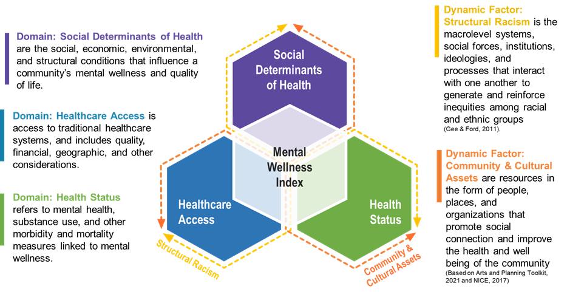

```{r setup, include=FALSE}
knitr::opts_chunk$set(echo = TRUE)
knitr::knit_hooks$set(optipng = knitr::hook_optipng)
# NOTE: once knit, move html output to www/
```

The MWI is a framework and tool that provides data on factors influencing community-level mental wellness for each ZIP code[^*] in the nation.

The MWI is composed of 28 measures organized under 3 domains: *Social Determinants of Health*, *Healthcare Access*, and *Health Status*. Additionally, the framework includes two dynamic factors: *Structural Racism* and *Community & Cultural Assets*. These factors are woven around and throughout the MWI domains, reflecting their influence throughout the framework.

[^*]: The term “ZIP Code” in the MWI tool refers to ZIP Code Tabulation Areas (ZCTAs). For more information on ZCTAs, please see census.gov and The Science Behind the MWI in the MWI Toolkit.

<center>\
</center>

<blockquote class="focus">The driving force behind the MWI is that equity delivered to historically marginalized populations will accrue to others and potentially catalyze movement toward social and racial justice.</blockquote>

The MWI is not intended to be a comprehensive evaluation of a community's mental wellness. We recommend use of the MWI in combination with local data and working alongside community groups to identify, account for, and include local-level factors that shape community mental wellness.

### What is Mental Wellness?

Mental Wellness means everyone in a community can thrive, regardless of a mental health or a substance use challenge.[^1]

[^1]: National Council for Mental Wellbeing (n.d.) We Are Mental Wellbeing. The National Council for Mental Wellbeing. <a href = 'https://www.thenationalcouncil.org/about/we-are-mental-wellbeing/' target = "_blank">(link)</a>

### Why MITRE Created the MWI

-   MITRE built the MWI because it fills a gap---there is no existing resource or health index to understand factors influencing mental wellness at the community or ZIP code level.
-   The MWI is intended to enable local, state, and federal government agencies, non-profits, and communities, to visualize the factors that contribute to mental wellness.
-   The MWI promotes data-informed decisions.

### The MWI Provides a Unique Perspective

-   The MWI **focuses on equity** by considering the influence of structural racism and community and cultural assets. Structural racism can have a negative impact on mental wellness. On the other hand, it is important to consider the strengths, identities, and aspirations that individuals and communities hold about themselves that promote mental wellness.
-   The MWI can be **modified to meet community needs**. Anyone interested in using the MWI can upload their own data and adjust the level of importance given to each measure.
-   The MWI allows you to see **comparisons** of geographic areas using objective data. This provides valuable information to communities, public health practitioners, government agencies, and funders seeking to improve mental wellness.
