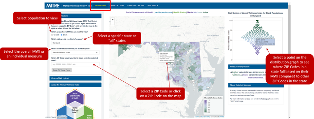
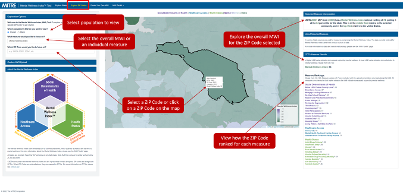

```{r setup, include=FALSE}
knitr::opts_chunk$set(echo = TRUE)
knitr::knit_hooks$set(optipng = knitr::hook_optipng)
library(vembedr)
library(fontawesome)
```

The MWI tool includes two main features: 

-   Explore the MWI and individual measures at the State level 

-   Explore the MWI and individual measures at the ZIP Code level 

Here you can find instructions on how to use the MWI, as well as videos and use cases to guide you.

> **Note**: MWI values and individual measure rankings show how a given ZIP Code compares to all other ZIP Codes in the nation on a range between 0 and 100.
>
> For the MWI, a higher value (closer to 100) indicates more resources or assets to support mental wellness, while a lower value (closer to 0) indicates more obstacles to mental wellness. Individual measure are displayed as rankings. For example, a Broadband Access measure ranking of 75 means that this ZIP Codes ranks higher than 75% of the ZIP Codes in the nation for this measure (not that 75% of individuals in the ZIP Code have broadband access).

### MWI Instructional Videos {.tabset}

Navigate to the [full playlist here](https://youtube.com/playlist?list=PLkTApXQou_8IFFkeJ4sqKq43hQK9lxsJj){target="_blank"} `r fa("link")`

#### Tool Overview 

```{r, echo = FALSE}
embed_youtube("5SsYGjfqbhk") %>%
  use_bs_responsive() 
```


#### Explore Maps 

```{r, echo = FALSE}
embed_youtube("baGT56pfyPA") %>%
  use_bs_responsive()
```


#### Data and Documentation 

```{r, echo = FALSE}
embed_youtube("BNkvRBkfxP4") %>%
  use_bs_responsive()
```


### How to Use the "Explore States" Tab

The Explore States option allows you to explore the MWI through an interactive map and distribution visualization. This option is useful if you would like to focus on a particular state or compare a ZIP Code to state-wide rankings.

To explore this option, you can:

-   Select population to view (either Overall or Black),

-   Select either a specific state or the entire country ("All" states),

-   Select to explore either the overall MWI or an individual measure.

-   Select a ZIP Code within their selected state by entering the numeric ZIP Code under "Exploration Options," or by clicking on a ZIP Code on the interactive map.

You can also explore the MWI by hovering over ZIP Codes on the map, or by hovering over points on the interactive distribution.



### How to Use the "Explore Zip Codes" Tab

The Explore Zip Codes option provides a community overview that shows the MWI and each individual measure for a specific ZIP Code. This page is useful to see all measures for a ZIP Code, or to focus on areas (which may cross state lines) surrounding a ZIP Code.

To explore this option, you can:

-   Select population to view (either Overall or Black),

-   Select to explore either the overall MWI or an individual measure from the drop down menu,

-   Select a ZIP Code by entering the numeric ZIP Code under "Exploration Options," or by clicking on a ZIP Code on the interactive map,

-   Explore the overall Mental Wellness Index for the ZIP Code selected and how it ranked in the state,

-   View how each measure ranked for that community.

<center></center>


<hr>

### How to Customize the MWI

You can customize the MWI to meet your needs. The MWI includes 28 measures, however, communities might have other important wellbeing factors they would like to include in their analysis which are not included as part of the baseline framework. It can be modified in the following ways:

-   Removing measures

-   Adding and replacing measures and data sets

-   Modifying measure weights

The second example in "MWI in Action" tab will provide guidance on how to create your own MWI. See the "*Example 2:* Creating Your Own MWI
" for detailed instructions. 


