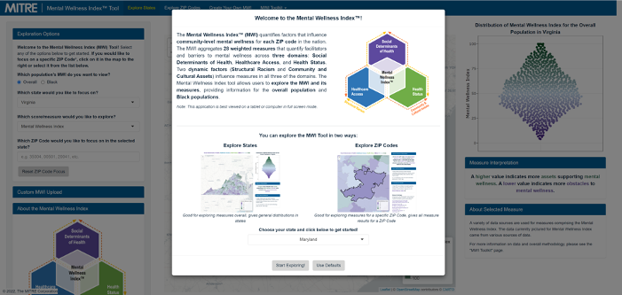
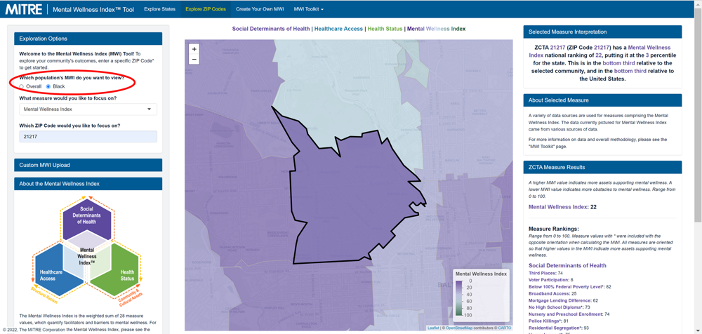

```{r setup, include=FALSE}
knitr::opts_chunk$set(echo = TRUE)
knitr::knit_hooks$set(optipng = knitr::hook_optipng)
```

The MWI tool includes two main features:

-   How to explore mental wellness at the State level

-   How to explore mental wellness at the ZIP Code level

Here you can find instructions on how to use the MWI, as well as videos and use cases to also guide you.

<!-- \<Insert MWI Overview Video here\> \<Insert Explore MWI Maps Video here\> -->

**How to Use the Explore States Tab**

The Explore States option allows you to explore the MWI through an interactive map and distribution visualization. This option is useful if you would like to focus on a particular state or compare a ZIP Code to state-wide rankings.

To explore this option, you can:

-   Select population to view (either Overall or Black),

-   Select either a specific state or the entire country ("All" states),

-   Select to explore either the overall MWI or an individual measure.

-   Select a ZIP Code within their selected state by entering the numeric ZIP Code under "Exploration Options," or by clicking on a ZIP Code on the interactive map.

You can also explore the MWI by hovering over ZIP Codes on the map, or by hovering over points on the interactive distribution.


**How to Use the Explore Zip Codes Tab**

The Explore Zip Codes option provides a community overview that shows the MWI and each individual measure for a specific ZIP Code. This page is useful to see all measures for a ZIP Code, or to focus on areas (which may cross state lines) surrounding a ZIP Code.

To explore this option, you can:

-   Select population to view (either Overall or Black),

-   Select to explore either the overall MWI or an individual measure from the drop down menu,

-   Select a ZIP Code by entering the numeric ZIP Code under "Exploration Options," or by clicking on a ZIP Code on the interactive map,

-   Explore the overall Mental Wellness Index for the ZIP Code selected and how it ranked in the state,

-   View how each measure ranked for that community.

<center></center>

**Use Case: Using the MWI to Understand the Mental Health Needs of a Community**

An organization in Baltimore, MD works to improve educational outcomes for youth and ensure families are healthy and successful in the West Baltimore area. They are conducting a community participatory budgeting process this summer to decide how to allocate their funding.

**Plan community conversations to review the MWI!**

The non-profit meets with members of the West Baltimore community to talk about the drivers of overall mental wellness, poor mental health and substance use disorders in their community. They guide the conversation following the three steps below.

<center></center>

<!-- I tried this -->

<!-- div { border: 1px solid #CCC; } -->

<!-- ::: {style="display: inline"} -->

```{=html}
<!-- Step 1: Review Measures in the MWI
The MWI contains 28 measures.  The organization
and community members explore the Mental Wellness Index of their community.
 -->
```
<!-- ::: -->

<!-- ::: {style="display: inline"} -->

```{=html}
<!-- Step 2: Explore MWI Score and Measures
The group notices some MWI measures for their
community are ranked higher or lower than the rest
of their state and the nation.  They also notice measure
areas that reflect key topics from their community discussion.
 -->
```
<!-- ::: -->

<!-- ::: {style="display: inline"} -->

```{=html}
<!-- Step 3: Identify Priority Mental Wellness Factors
Based on their community conversations and review of the
measures in the MWI, the organization selects three measures
to prioritize as part of their budget decision making process: 
•   Voter participation (a measure of social capital), 
•   No high school diploma (an education measure), and 
•   Unemployment (a measure of employment).
 -->
```
<!-- ::: -->

<!-- I also tried this  -->

```{=html}
<!-- <span>Step 1: Review Measures in the MWI
The MWI contains 28 measures.  The organization and
community members explore the Mental Wellness Index of their community.
</span> -->
```
```{=html}
<!-- <span>Step 2: Explore MWI Score and Measures
The group notices some MWI measures for their community
are ranked higher or lower than the rest of their state and
the nation.  They also notice measure areas that reflect key
topics from their community discussion.
</span> -->
```
```{=html}
<!-- <span>Step 3: Identify Priority Mental Wellness Factors
Based on their community conversations and review of the measures
in the MWI, the organization selects three measures to prioritize 
as part of their budget decision making process: 
•   Voter participation (a measure of social capital), 
•   No high school diploma (an education measure), and 
•   Unemployment (a measure of employment).
</span> -->
```
<!-- I tried some other failed methods too - let me know if you'd like to see them -->

**Step 1: Review Measures in the MWI**

The MWI includes 28 measures organized under three domains: Social Determinants of Health, Healthcare Access, and Health Status. The organization and community members explore the Mental Wellness Index of their community.

The organization enters the ZIP code in the MWI tool for their community to see the overall Mental Wellness Index measure. To do so, they follow these steps:

-   Go to the MWI tool, select "Maryland" from the drop-down menu, and select "Start Exploring!

<center></center>

-   Since the group is interested in a community in a specific zip code, they select the "Explore ZIP Codes" option:

<center></center>

-   The group is interested in seeing the Mental Wellness Index for the Black population living in their zip code, so they go to the "Exploration Options" section and select "Black" for "Which population's MWI do you want to view?":

<center></center>

-   As a group they have decided to look at the overall Mental Wellness Index first so they select "Mental Wellness Index" from the drop-down menu under "What measure would you like to focus on?"

<center></center>

-   The group starts exploring the tool by entering the ZIP Code number, which gives them the opportunity to take a closer look at their community:

<center></center>

**Step 2: Explore MWI Score and Measures**

The group decides to take a closer look at the MWI score and measures results for their community.

-   On the right hand-side they see their community has an overall Mental Wellness Index score of 22, a low score compared to the rest of the nation.

<center></center>

-   They also notice their community Mental Wellness is low compared to the Mental Wellness Index of their state.

<center></center>

-   To better understand what are the specific Mental Wellness areas that need to be targeted to improve the mental wellness of their community, they explore the score for each individual measure. They focus on those with a lower score as those indicate more obstacles to mental wellness.

<center></center>

**Step 3: Identify Priority Mental Wellness Factors**

Based on their community conversations and review of the measures in the MWI, the organization selects three measures to prioritize as part of their budget decision making process.

-   Voter participation (a measure of social capital),

-   No high school diploma (an education measure), and

-   Unemployment (a measure of employment.

    <center></center>

Now the organization and community members can discuss and make a data-informed decision on how to best allocate funds to support their community!

**How to Customize the MWI**

You can customize the MWI to meet your needs. The MWI includes 28 measures, however, communities might have other important wellbeing factors they would like to include in their analysis which are not included as part of the baseline framework. It can be modified in the following ways:

-   Removing measures

-   Adding and replacing measures and data sets

-   Modifying measure weights

The following videos and use case will provide guidance on how to create your own MWI.

<!-- \<Insert Create your own MWI\> \<Insert Downloading Data and Viewing Documentation\> -->

**Use Case: Creating Your Own MWI**

A non-profit is partnering with a county in California to decide how to allocate its resources to promote mental wellbeing. They are specifically interested in focusing on upstream factors -- like income, housing, education, and access to health care -- that can contribute to the prevention of poor mental health outcomes. They also found additional factors important to their community not included in the MWI, for example access to primary health care. Their goal is to identify the upstream factors impacting mental wellbeing in that county and to use these factors to identify priority ZIP codes where they can work to promote mental wellbeing.

**Plan community conversations to review the MWI.**

The non-profit meets with members from the community to talk about the drivers of overall mental wellness, poor mental health and substance use disorders in their community. They guide the conversation following the steps below.

<!-- I don't have hyperlinks for the 7 below sentences that call for them -->

Click here to access resources to help you guide data conversations with communities.

**Step 1: Review Measures in the MWI**

The MWI contains 28 measures. The non-profit and community members review the measures and decide they need to modify the MWI to meet their needs. They need to add some new measures, remove some of them, and review and adjust the weights for the measures.

Click here for instructions on where to find the list of measures

**Step 2: Identify Data for the New Measure**

The community **identified access to primary health care** as an important way to help promote mental wellness.

The non-profit organization decides to include a measure for "Access to Community Health Centers, and remove the measures"Alcohol Outlet Density", and "Financial Access".

Click here for instructions on how to identify a new data set

**Step 3: Update the Individual Measure Weights**

The organization now has 27 measures they will use to customize their own MWI. They review the measures and adjust the weights for each measure.

Click here for instructions on how to customize the weights for each measure in the MWI

**Step 4: Update MWI Metadata**

The organization downloads the MWI metadata file and updates the file to include the new list of measures.

Click here for instructions on how to modify the data for the customized MWI

**Step 5: Prep New Measure Data**

To use the new "Access to Community Health Center" measure data in the MWI, the organization prepares their data file.

Click here for instructions on how to prepare your data file for the customized MWI

**Step 6: Run the Customized MWI**

Now the organization is ready to run their customized MWI.

Click here for instructions on how to generate your customized MWI


<center>**Now the group can use the customized MWI to explore mental wellness factors in California!**</center>


**Step 1: Review Measures in the MWI**

The MWI includes 28 measures organized under three domains: Social Determinants of Health, Healthcare Access, and Health Status. The organization and community members review the list of measures and decide to add a new measure -- *Access to Community Health Centers --* and remove two measures: *Access to Access to Financial Services* and *Alcohol Outlet Density*.

**Step 2: Identify Data for the New Measure**

Because the community identified access to primary health care as an important way to help promote mental wellness, they decide to add a measure to health care access to reflect the availability of safety net care through community health centers -- *Access to Community Health Centers*.

The organization identifies a reliable data source they can use from the Health Services and Resources Administration's (HRSA) Bureau of Primary Health Care on access to community health centers -- *Health Center Penetration* -- and obtain access to the data.

**Health Center Penetration**

HRSA defines this measure as the ratio of the population served by a health center to the population with household income below 200% of the Federal Poverty Level (FPL). More information about this measure is available from HRSA under Health Center Penetration in the [Unmet Need Score (UNS) and Service Area Status (SAS) Resource Guide](https://bphc.hrsa.gov/sites/default/files/bphc/funding/uns-resource-guide.pdf). Data for the measure is available in the [UNS Workbook](https://bphc.hrsa.gov/sites/default/files/bphc/funding/unmet-need-score-workbook.xlsx) (Excel document download) in Column Q "Health Center Penetration" after ZIP codes have been entered in Column A.

**Step 3: Update the Individual Measure Weights**

After adding *Access to Community Health Centers* to the Health Care Access domain and removing *Alcohol Outlet Density* and *Access to Financial Services*, from the Social Determinants of Health domain, the organization now has a total of 27 measures they will use to customize their own MWI.

They use the MWI default domain weights of 60% for Social Determinants of Health, 15% for Health Care Access, and 25% for Health Status.

The organization equally divides the domain weights by the number of measures in the domain. They divide of 60% for social determinants of health by the 13 social determinant of health measures, 15% for healthcare access by the 4 healthcare access measures, and 25% for health status by the 10 health status measures. The new proposed individual measure weights are:

|     |                                   |     |                         |     |                                  |     |                                                      |     |
|--------|--------|--------|--------|--------|--------|--------|--------|--------|
|     | **Domain**                        |     | **Total Domain Weight** |     | **Number of Measures in Domain** |     | **Individual Weight for Each Measure in the Domain** |     |
|     |                                   |     |                         |     |                                  |     |                                                      |     |
|     | **Social Determinants of Health** |     | 60%                     |     | 13                               |     | 4.61%                                                |     |
|     |                                   |     |                         |     |                                  |     |                                                      |     |
|     | **Healthcare Access**             |     | 15%                     |     | 4                                |     | 3.75%                                                |     |
|     |                                   |     |                         |     |                                  |     |                                                      |     |
|     | **Health Status**                 |     | 25%                     |     | 10                               |     | 2.5%                                                 |     |
|     |                                   |     |                         |     |                                  |     |                                                      |     |

**Note!**

The default MWI gives less weight to measures that are not at the ZIP Code level or stratified for Black populations (Given that this was the first priority population). Learn more about the [MWI's Measure Weighting](https://github.com/mitre/hse-mwi/blob/main/Documentation/Methods/Weighting_Methods.pdf).

The MWI default domain weights are: 60% for Social Determinants of Health, 15% for Health Care Access, and 25% for Health Status. These domain weights were developed based on established research literature about the contribution of different factors to health outcomes.

**Step 4: Update MWI Metadata**

They download the MWI metadata file (metadata.xlsx) by going to the "Create Your Own MWI" tab and choosing "Add Local Data to MWI" under that menu. At the bottom of the page, they click the button, "Download Metadata.xlsx", which downloads the file.

Next, they edit the metadata.xlsx file to reflect the new *Access to Community Health Centers* measure, removal of the *Access to Financial Services* and *Alcohol Outlet Density* measures, and the new measure weights.

1.  Delete Row 2 "Access to Financial Services" and Row 4 "Alcohol Outlet Density"
2.  Enter a new row "Access to Community Health Centers" and fill in all the respective columns for this new measure, as described in the "Column Descriptions" sheet of Metadata.xlsx.
3.  In column I "Weights" enter 4.61 for each Social Determinants of Health Measure, 3.75 for each Healthcare Access Measure (including the Access to Community Health Centers measure), and 2.5 for each Health Status Measure.
4.  Save the metadata file.

Note: A list of California ZIP codes is available at: <https://data.ca.gov/dataset/county-and-zip-code-references>.

**Step 5: Prep New Measure Data**

To use the new *Access to Community Health Center* measure data in the MWI, the organization saves it in a comma separated value format file (.CSV) with two columns. The first column contains the 5-digit ZIP Code, and the second column contains the measure value. They make sure all the ZIP Codes for California are listed with its respective value and save the file as healthcenter.csv.

For additional guidance on how to format and prepare new measure data, see the [Create Your Own MWI](https://github.com/mitre/hse-mwi#Instructions-to-Create-Your-Own-MWI) instructions.

**Step 6: Run the Customized MWI**

The organization can now upload the metadata.xlsx and healthcenter.csv files to run their customized MWI.

Note that data uploaded to this application is not kept \-- it is deleted once you leave the page, including any processing done to it. However, if you would like to keep your data on your computer while creating the MWI, please see the "Add Local Data to MWI on Your Computer" section.

1.  Upload the saved Metadata.xlsx and healthcenter.csv files on the Create Your Own MWI tab, then click 'Create Custom MWI' below the instructions. This will take some time, depending on the amount of measures included.

2.  Once the custom MWI creation is complete, click 'Download Custom MWI' to download an .RData file with all of the needed information to view your MWI in this tool. **Note: if you navigate away from this page, all processing and data will be lost! Nothing is stored within this application.**

3.  To view your MWI, click the "Custom MWI Upload" box under "Explore States" or "Explore ZIP Codes" and upload the downloaded ".RData" file.

4.  After a delay (this will be slow the first time, then quicker after that), the Mental Wellness Index Tool should open in your browser. Click on the "Create Your Own MWI" tab and follow the remaining steps to create your own MWI.

Note: Once you customized the MWI, you can only compare between ZIP Codes added when creating
the new MWI. For instance, this organization will only be able to see California data, as the new data set only includes data for California.

**California New MWI**

Now the group can explore the new MWI for the entire State of California and each of the measures! They can also enter specific ZIP codes in California to explore them individually. Additionally, they can select whether they want to explore the rankings for the overall population or the Black population.

Note: Because Black populations are ranked against other Black populations, their rankings cannot be compared to the overall population, and vice versa.
