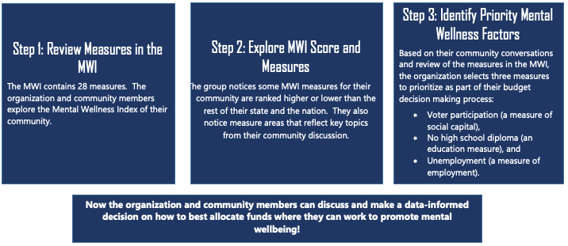
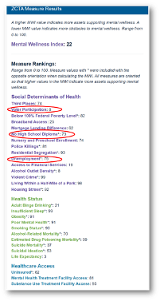
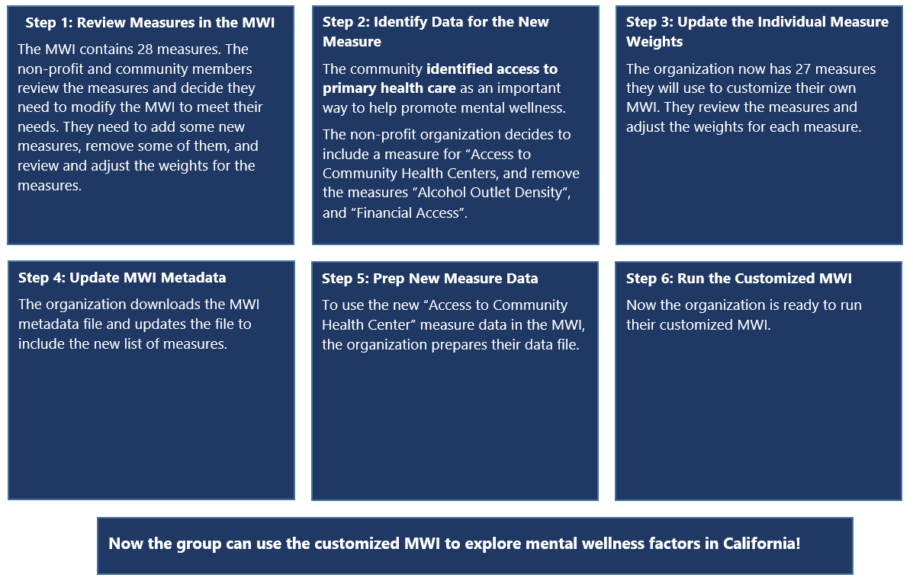

```{r setup, include=FALSE}
knitr::opts_chunk$set(echo = TRUE)
knitr::knit_hooks$set(optipng = knitr::hook_optipng)
library(slickR)
```

## How to Use the MWI

The MWI is designed to **promote data-informed decisions, encourage more equitable allocation of resources,** and support decision making **in partnership with communities** (rather than on the behalf of communities).
Potential uses include:

-   **Grant Application Support**: The MWI can be used as a tool to provide evidence and data to justify community-level need for grant applications.
-   **Community-Level Planning & Advocacy**: The MWI's ZIP Code-level focus can help inform community-level efforts to address factors related to mental wellness and make the case to decision makers.
-   **Objective, Data Comparisons**: The MWI provides a standardized way to compare factors contributing to mental wellness across ZIP Codes that can help inform decision makers about where to focus resources.
-   **Prioritizing Geographic Areas**: The MWI can be used to identify high priority areas within a larger geographic area based on data and evidence.

### *Example 1:* Using the MWI to Understand the Mental Health Needs of a Community

An organization in Baltimore, MD works to improve educational outcomes for youth and ensure families are healthy and successful in the West Baltimore area.
They are conducting a community participatory budgeting process this summer to decide how to allocate their funding.

+---------------------------------------------------------------------------------------------------------------------------------------------------+---------------------------------------------------------------------------------------------------------------------------------------------------------------------------------------------------------------------------------------------------------+
| <center></center> | **Plan community conversations to review the MWI!**                                                                                                                                                                                                     |
|                                                                                                                                                   |                                                                                                                                                                                                                                                         |
|                                                                                                                                                   | The non-profit meets with members of the West Baltimore community to talk about the drivers of overall mental wellness, poor mental health and substance use disorders in their community. They guide the conversation following the three steps below. |
+---------------------------------------------------------------------------------------------------------------------------------------------------+---------------------------------------------------------------------------------------------------------------------------------------------------------------------------------------------------------------------------------------------------------+

<center></center>

###  {.tabset .tabset-pills}

Click on each step below to learn how about how the organization used the MWI.

#### Step 1

##### Step 1: Review Measures in the MWI

The MWI includes 28 measures organized under three domains: Social Determinants of Health, Healthcare Access, and Health Status.
The organization and community members explore the Mental Wellness Index of their community.

The organization enters the ZIP code in the MWI tool for their community to see the overall Mental Wellness Index measure.

> Click the arrows on the right and left of the image below to see screenshots of their steps in the MWI tool.

```{r echo=FALSE}
review_measures <- list.files("images", pattern = "review_measures",full.names = TRUE)
review_captions <- c("1. Go to the MWI tool, select \"Maryland\" from the drop-down menu, and select \"Start Exploring!\"",
                     "2. Since the group is interested in a community in a specific zip code, they select the \"Explore ZIP Codes\" option:",
                     "3. The group is interested in seeing the Mental Wellness Index for the Black population living in their zip code, so they go to the \"Exploration Options\" section and select \"Black\" for \"Which population's MWI do you want to view?\":",
                     "4. As a group they have decided to look at the overall Mental Wellness Index first so they select \"Mental Wellness Index\" from the drop-down menu under \"What measure would you like to focus on?\"",
                     "5. The group starts exploring the tool by entering the ZIP Code number, which gives them the opportunity to take a closer look at their community:")
slickR(obj = review_measures, height = 400, width = "95%") %synch%
  (slickR(review_captions, slideType = 'p') + settings(arrows=FALSE))
```

<hr>

#### Step 2

##### Step 2: Explore MWI Score and Measures

The group decides to take a closer look at the MWI score and measures results for their community.

> Click the arrows on the right and left of the image below to see screenshots of their steps in the MWI tool.

```{r echo=FALSE}
explore_images <- list.files(path = "images", pattern="explore", full.names = TRUE)[3:5]
explore_captions <- c("1. On the right hand-side they see their community has an overall Mental Wellness Index score of 22, a low score compared to the rest of the nation.",
                      "2. They also notice their community Mental Wellness is low compared to the Mental Wellness Index of their state.",
                      "3. To better understand what are the specific Mental Wellness areas that need to be targeted to improve the mental wellness of their community, they explore the score for each individual measure. They focus on those with a lower score as those indicate more obstacles to mental wellness.
")

slickR(obj = explore_images, height = 400, width = "95%") %synch%
  (slickR(explore_captions, slideType = 'p') + settings(arrows=FALSE))
```

<hr>

#### Step 3

##### Step 3: Identify Priority Mental Wellness Factors

Based on their community conversations and review of the measures in the MWI, the organization selects three measures to prioritize as part of their budget decision making process.

-   Voter participation (a measure of social capital),

-   No high school diploma (an education measure), and

-   Unemployment (a measure of employment).

    <center></center>

Now the organization and community members can discuss and make a data-informed decision on how to best allocate funds to support their community!

<hr>

### *Example 2:* Creating Your Own MWI

A non-profit is partnering with a county in California to decide how to allocate its resources to promote mental wellbeing.
They are specifically interested in focusing on upstream factors -- like income, housing, education, and access to health care -- that can contribute to the prevention of poor mental health outcomes.
They also found additional factors important to their community not included in the MWI, for example access to primary health care.
Their goal is to identify the upstream factors impacting mental wellbeing in that county and to use these factors to identify priority ZIP codes where they can work to promote mental wellbeing.

+---------------------------------------------------------------------------------------------------------------------------------------------------+--------------------------------------------------------------------------------------------------------------------------------------------------------------------------------------------------------------------------------------+
| <center></center> | **Plan community conversations to review the MWI.**                                                                                                                                                                                  |
|                                                                                                                                                   |                                                                                                                                                                                                                                      |
|                                                                                                                                                   | The non-profit meets with members from the community to talk about the drivers of overall mental wellness, poor mental health and substance use disorders in their community. They guide the conversation following the steps below. |
+---------------------------------------------------------------------------------------------------------------------------------------------------+--------------------------------------------------------------------------------------------------------------------------------------------------------------------------------------------------------------------------------------+

<center></center>


###  {.tabset .tabset-pills}

Click on each step below to learn how about how the organization used the MWI.

#### Step 1

##### Step 1: Review the Measures in the MWI

The MWI includes 28 measures organized under three domains: Social Determinants of Health, Healthcare Access, and Health Status.
The organization and community members review the list of measures and decide to add a new measure -- *Access to Community Health Centers --* and remove two measures: *Access to Access to Financial Services* and *Alcohol Outlet Density*.

<hr>

#### Step 2

##### Step 2: Identify Data for the New Measure

Because the community identified access to primary health care as an important way to help promote mental wellness, they decide to add a measure to health care access to reflect the availability of safety net care through community health centers -- *Access to Community Health Centers*.

The organization identifies a reliable data source they can use from the Health Services and Resources Administration's (HRSA) Bureau of Primary Health Care on access to community health centers -- *Health Center Penetration* -- and obtain access to the data.

> **Health Center Penetration**
>
> HRSA defines this measure as the ratio of the population served by a health center to the population with household income below 200% of the Federal Poverty Level (FPL).
> More information about this measure is available from HRSA under Health Center Penetration in the [Unmet Need Score (UNS) and Service Area Status (SAS) Resource Guide](https://bphc.hrsa.gov/sites/default/files/bphc/funding/uns-resource-guide.pdf){target="_blank"}.
> Data for the measure is available in the [UNS Workbook](https://bphc.hrsa.gov/sites/default/files/bphc/funding/unmet-need-score-workbook.xlsx){target="_blank"} (Excel document download) in Column Q "Health Center Penetration" after ZIP codes have been entered in Column A.

<hr>

#### Step 3

##### Step 3: Update the Individual Measure Weights

After adding *Access to Community Health Centers* to the Health Care Access domain and removing *Alcohol Outlet Density* and *Access to Financial Services*, from the Social Determinants of Health domain, the organization now has a total of 27 measures they will use to customize their own MWI.

They use the MWI default domain weights of 60% for Social Determinants of Health, 15% for Health Care Access, and 25% for Health Status.

The organization equally divides the domain weights by the number of measures in the domain.
They divide of 60% for social determinants of health by the 13 social determinant of health measures, 15% for healthcare access by the 4 healthcare access measures, and 25% for health status by the 10 health status measures.
The new proposed individual measure weights are:

+-----------------------------------+-------------------------+----------------------------------+------------------------------------------------------+
| **Domain**                        | **Total Domain Weight** | **Number of Measures in Domain** | **Individual Weight for Each Measure in the Domain** |
+-----------------------------------+-------------------------+----------------------------------+------------------------------------------------------+
| **Social Determinants of Health** | 60%                     | 13                               | 4.61%                                                |
+-----------------------------------+-------------------------+----------------------------------+------------------------------------------------------+
| **Healthcare Access**             | 15%                     | 4                                | 3.75%                                                |
+-----------------------------------+-------------------------+----------------------------------+------------------------------------------------------+
| **Health Status**                 | 25%                     | 10                               | 2.5%                                                 |
+-----------------------------------+-------------------------+----------------------------------+------------------------------------------------------+

> **Note:** The default MWI gives less weight to measures that are not at the ZIP Code level or stratified for Black populations (Given that this was the first priority population).
> Learn more about the [MWI's Measure Weighting](https://github.com/mitre/hse-mwi/blob/main/Documentation/Methods/Weighting_Methods.pdf){target="_blank"}.
>
> The MWI default domain weights are: 60% for Social Determinants of Health, 15% for Health Care Access, and 25% for Health Status.
> These domain weights were developed based on established research literature about the contribution of different factors to health outcomes.

<hr>

#### Step 4

##### Step 4: Update MWI Metadata

They download the MWI metadata file (metadata.xlsx) by going to the "Create Your Own MWI" tab and choosing "Add Local Data to MWI" under that menu.
At the bottom of the page, they click the button, "Download Metadata.xlsx", which downloads the file.

Next, they edit the metadata.xlsx file to reflect the new *Access to Community Health Centers* measure, removal of the *Access to Financial Services* and *Alcohol Outlet Density* measures, and the new measure weights.

1.  Delete Row 2 "Access to Financial Services" and Row 4 "Alcohol Outlet Density"
2.  Enter a new row "Access to Community Health Centers" and fill in all the respective columns for this new measure, as described in the "Column Descriptions" sheet of Metadata.xlsx.
3.  In column I "Weights" enter 4.61 for each Social Determinants of Health Measure, 3.75 for each Healthcare Access Measure (including the Access to Community Health Centers measure), and 2.5 for each Health Status Measure.
4.  Save the metadata file.

> **Note:** A list of California ZIP codes is available at: <https://data.ca.gov/dataset/county-and-zip-code-references>{target="_blank"}.

<hr>

#### Step 5

##### Step 5: Prep New Measure Data

To use the new *Access to Community Health Center* measure data in the MWI, the organization saves it in a comma separated value format file (.CSV) with two columns.
The first column contains the 5-digit ZIP Code, and the second column contains the measure value.
They make sure all the ZIP Codes for California are listed with its respective value and save the file as healthcenter.csv.

For additional guidance on how to format and prepare new measure data, see the [Create Your Own MWI](https://github.com/mitre/hse-mwi#Instructions-to-Create-Your-Own-MWI){target="_blank"} instructions.

<hr>

#### Step 6

##### Step 6: Run the Customized MWI

The organization can now upload the metadata.xlsx and healthcenter.csv files to run their customized MWI.

Note that data uploaded to this application is not kept \-- it is deleted once you leave the page, including any processing done to it.
However, if you would like to keep your data on your computer while creating the MWI, please see the "Add Local Data to MWI on Your Computer" section.

1.  Upload the saved Metadata.xlsx and healthcenter.csv files on the Create Your Own MWI tab, then click 'Create Custom MWI' below the instructions.
    This will take some time, depending on the amount of measures included.

2.  Once the custom MWI creation is complete, click 'Download Custom MWI' to download an .RData file with all of the needed information to view your MWI in this tool.
    **Note: if you navigate away from this page, all processing and data will be lost! Nothing is stored within this application.**

3.  To view your MWI, click the "Custom MWI Upload" box under "Explore States" or "Explore ZIP Codes" and upload the downloaded ".RData" file.

4.  After a delay (this will be slow the first time, then quicker after that), the Mental Wellness Index Tool should open in your browser.
    Click on the "Create Your Own MWI" tab and follow the remaining steps to create your own MWI.

> **Note**: Once you customized the MWI, you can only compare between ZIP Codes added when creating the new MWI.
> For instance, this organization will only be able to see California data, as the new data set only includes data for California.

**California New MWI**

Now the group can explore the new MWI for the entire State of California and each of the measures!
They can also enter specific ZIP codes in California to explore them individually.
Additionally, they can select whether they want to explore the rankings for the overall population or the Black population.

> **Note**: Because Black populations are ranked against other Black populations, their rankings cannot be compared to the overall population, and vice versa.

<hr>

## Data Conversations with Communities

The MWI is intended to be used in partnership with communities.
Consider hosting data conversations to review the data with community members.
These conversations can engage communities, solicit their perspectives, and yield new insights for interpreting the data.

Here are a few tips to ensure respectful and fruitful data conversations:

-   If you are not with a community-based organization yourself, work with one that is trusted by the community.
    The community-based organization can help you to recruit participants and understand the community's values and preferences.

-   Community members are experts about their neighborhoods.
    Open the conversation with one or two introductory exercises to highlight their expertise (see the Guide to Data Chats below for examples).

-   Ask community members what mental wellness means to them.
    How do they define mental wellness?

-   Acknowledge there is mistrust of researchers among communities of color due to historical events.
    Frame the data conversations as a way to build trust with community members.
    Use a partnerships approach that focuses on mutual benefit to communities and you/your organization.

-   Help community members to see themselves in the data so that it seems less academic.
    Highlight ways that community members use data every day.\

-   Ensure that any materials you share are written in plain language and have images that reflect the local community.

-   Community members' time is valuable.
    Compensate them with gift cards, cash, or other incentives that they would appreciate.\

-   Be flexible when facilitating data conversations.
    Allow people to share their thoughts, even if it seems outside of scope of your project.
    This can reveal new insights about mental wellness and build trust by making communities feel heard.\

See the following resources for more tips and ideas:

-   [Guide to Data Chats: Convening Community Conversations About Data](https://www.neighborhoodindicators.org/sites/default/files/publications/Guide%20to%20Data%20Chats%E2%96%A1%20Convening%20Community%20Conversations%20about%20Data.pdf){target="_blank"} by the Urban Institute and National Neighborhood Indicators Partnership

-   [Plain Language](https://www.plainlanguage.gov/about/definitions/){target="_blank"} by the Plain Language Action and Information Network

<blockquote class="focus">

The driving force behind the MWI is that equity delivered to historically marginalized populations will accrue to others and potentially catalyze movement toward social and racial justice.

</blockquote>
