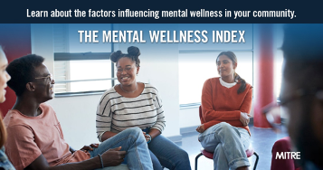
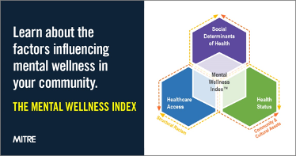

```{r setup, include=FALSE, echo=FALSE}
knitr::opts_chunk$set(echo = TRUE)
knitr::knit_hooks$set(optipng = knitr::hook_optipng)
```

The Mental Wellness Index can influence, guide, inform various organizations and agencies about the factors influencing mental wellness at the community level. Organizations that may find the MWI useful include community-based organizations, universities, national non-profits, health departments, and government agencies.

Use these resources to let others know about the MWI:

-   [MWI fact sheet](images/MWI-fact-sheet-02-10_PRS.pdf)

-   [Sample newsletter article](images/MWI Sample Newsletter Article.pdf)

-   Sample social media content and graphics


### Social Media Content and Graphics

<hr>

#### Social Media Post #1

The Mental Wellness Index quantifies 28 factors that influence community-level mental wellness for each ZIP code in the nation. These insights can promote data-informed decisions and more equitable allocation of resources in partnership with communities. Learn more: <https://sjp.mitre.org/mwi>



> **Note:** Right click on the image and "Save image as..." to download.


<hr>

#### Social Media Post #2

Do you know which factors are influencing #mentalwellness in your community? How does your community compare to others in your state or across the nation? The Mental Wellness Index can show you using an easy-to-use data tool. <https://sjp.mitre.org/mwi>



> **Note:** Right click on the image and "Save image as..." to download.


<hr> 

<blockquote class="focus">The driving force behind the MWI is that equity delivered to historically marginalized populations will accrue to others and potentially catalyze movement toward social and racial justice.</blockquote>

