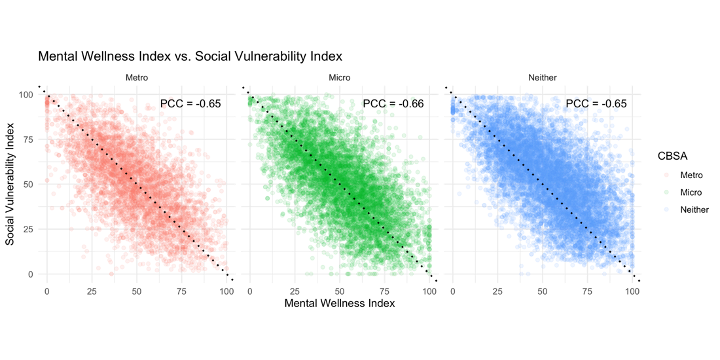
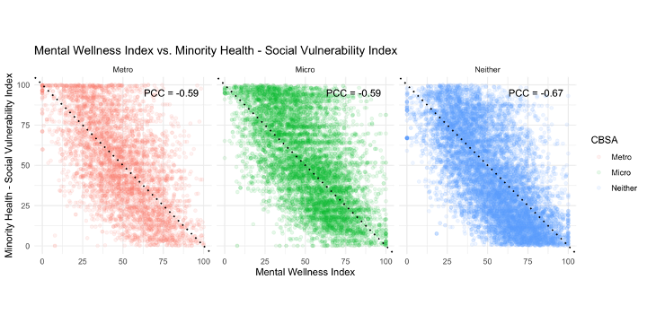
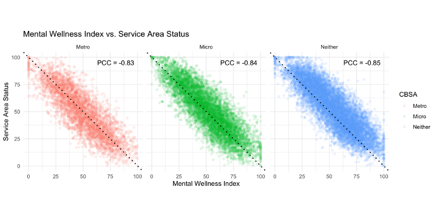
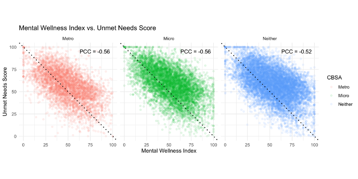
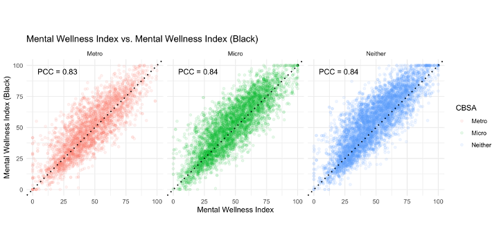

```{r setup, include=FALSE}
knitr::opts_chunk$set(echo = TRUE)
knitr::knit_hooks$set(optipng = knitr::hook_optipng)
```

The MWI fills a gap - There is no existing tool that summarizes the factors influencing mental wellness of communities for the entire nation at a geographically granular level (such as the ZIP Code level) and provides results for Black populations and the overall population.

The goal of the MWI is to provide an objective, data-based snapshot of the factors that influence mental well-being at the ZIP Code level. This allows for a "like-to-like" comparison of areas and can help inform users (in partnership with impacted communities) about how best to distribute resources for the highest impact, and to advocate for their communities.

**Did you know ZIP codes and ZCTAs are slightly different?**

The MWI has been created based on ZCTAS.

-   The term ZIP codes stand for: Zone Improvement Plan Codes. These were created by the U.S. Postal Service to improve mail delivery service. They are based on postal routes which factor in delivery-area, mail volume, and geographic location.

<!-- -->

-   ZCTAs stands for: ZIP Code Tabulation Areas. These were created by the U.S. Census Bureau. These have been assigned to census blocks. They represent a geographic location of populated areas.

<!-- -->

-   For the most part, the geographic area of a ZIP Code is the same as the ZCTA.

<!-- -->

-   In the MWI, the term "ZIP code" refers to ZIP Code Tabulation Areas (ZCTAs)

Source: Conduent HealthyCommunities Institute. Accessed on June 28, 2022. Link: <https://help.healthycities.org/hc/en-us/articles/115006016767-What-is-the-difference-between-ZIP-Codes-and-ZCTAs->

Methods

All methods used to calculate unique statistical procedures can also be accessed below. Click on the link to download the corresponding documentation.

-   [Facility Weights](https://github.com/mitre/hse-mwi/blob/main/Documentation/Methods/Facility_Weights_Methods.pdf?raw=true)

-   [Geography](https://github.com/mitre/hse-mwi/blob/main/Documentation/Methods/Geography_Methods.pdf?raw=true)

-   [Two Step Floating Catchment Methodology](https://github.com/mitre/hse-mwi/blob/main/Documentation/Methods/Two_Step_Floating_Catchment_Area.pdf?raw=true)

-   [Measure Weighting](https://github.com/mitre/hse-mwi/blob/main/Documentation/Methods/Weighting_Methods.pdf?raw=true)

[**Limitations and Challenges**]{.underline}

Limitations that we faced based on the types of data that are available and collected in national datasets include the following:

1.  Lack of access to geographically granular data on certain topics
2.  Lack of data stratified by demographics such as race, ethnicity, sexual orientation, English proficiency/language, etc.
3.  Most data are deficit-focused, and deficit-focused data may not represent community-based perspectives and lack a focus on assets and strengths.
4.  Impact of structural racism inherent to the research enterprise, which impacts areas such as survey development, sampling, data collection and analysis, etc.
5.  Some populations, such as individuals experiencing homelessness, may not be represented in various national datasets

Because data were aggregated from multiple data sources, we note that all data are not from the same year or range of years. Additionally, some measures that strongly aligned with the measure evaluation and selection criteria (see below) were included even though they could not be stratified by race, so calculations based on these measures may have lower validity for Black populations. Race stratified data were available for 14 measures, unavailable for 8 measures, and not applicable for 6 measures.

Nationally representative, geographically granular data were unavailable for a wide range of topics that impact mental wellness, such as social connectedness[^1]; sense of belonging; access to safe, reliable, and efficient transportation; community allostatic load[^2]; and access to culturally and linguistically appropriate care, among others. If data on these, or other topics, are available at the local level, using the MWI tool data upload feature can enhance the results of the MWI.

[^1]: Office of Disease Prevention and Health Promotion (n.d.). *Social Cohesion*. Healthy People 2030. <https://health.gov/healthypeople/objectives-and-data/social-determinants-health/literature-summaries/social-cohesion>

[^2]: Chandra, A., Cahill, M., Yeung, D., & Ross, R. (2018) *Toward an Initial Conceptual Framework to Assess Community Allostatic Load: Early Themes from Literature Review and Community Analyses on the Role of Cumulative Community Stress.* RAND Corporation. Available at: <https://www.rand.org/pubs/research_reports/RR2559.html>

[We had a limited ability to consult directly with communities in the creation of the MWI]{.underline}. Input from communities that are directly impacted is vital to ensure a tool will be most useful for them. While we consulted with and had input from selected community leaders and program providers in Black communities, we did not have direct input from community residents. In our next steps, we hope to engage directly with communities to understand their priorities and preferences, incorporate participatory approaches, and work with communities to understand how the MWI can best address their needs.

[We have sought to address these challenges by]{.underline}:

-   Prioritizing race-stratified measures.

-   Building adaptive features into the MWI tool that allow users to upload community-specific data (effectively adding and removing measures), and weight measures according to their values and preferences.

-   Incorporating creative measure constructs by including measures of assets that are not "traditionally" included in health indices (e.g., third places, access to financial services, voter participation, etc.), and application of novel methodologies to represent key constructs (e.g., using data about treatment facility characteristics in addition to location data).

-   Committing to document and share recommendations related to challenges with others to positively influence change.

Please see [measure documentation](https://github.com/mitre/hse-mwi/tree/main/Documentation/Measures) for more information on the strengths and limitations of specific measures selected.

[**Validity Testing**]{.underline}

Analytic and face validity were verified evaluate the robustness, validity, and accuracy of the MWI. As part of the analytic validity testing, the team examined the correlation of the MWI with other major health indices, including the Social Vulnerability Index, Minority Health Social Vulnerability Index, the Child Opportunity Index, and the Health Resources and Service Administration's Service Area Status and Unmet Need Score. We grouped ZCTAs by their Core-Based Statistical Areas (CBSA) designations to analyze relationships by varying population densities: metro (urbanized areas with 50,000 or more inhabitants) , micro (at least one urban cluster of at least 10,000 but less than 50,000), and neither (fewer than 10,000 -- representing non-urban areas).[^3] We expect to see Pearson correlation coefficients (PCC) between 0.5 \<= \|r\| \<= 0.8), signifying those patterns of contributors to mental wellness correlate with other health indices as supported by literature, but also that the MWI does not providing completely redundant information (i.e., \|r\| = 1.0). Additionally, we analyzed ZCTA rankings between the MWI's overall population and Black populations results to understand the consistency of a ZCTA's relative ranking when examining data describing assets and obstacles within Black populations versus the overall population. Here, we observe higher PCC values for this correlation as well as a tapered pattern with strong alignment near the upper and low ends of the distribution, indicating that high and low ranked ZCTAs are consistent between Black and overall populations.

[^3]: [Glossary (census.gov)](https://www.census.gov/programs-surveys/geography/about/glossary.html#par_textimage_7)

Our findings show that the MWI is correlated with other health indices with a PCC of 0.52 \<= \|r\| \<= 0.85). This is generally in line with our expected results. Analytic graphs are provided below. 

To test its face validity, multiple listening sessions were held with 5 community key informants to solicit feedback on ways to improve the MWI and the MWI tool to increase its validity and usefulness. Community key informants included representatives from community-based organizations, nonprofits, and local public health practitioners. Themes that emerged from the listening sessions included:

-   Mental wellness has different connotations for different communities.
-   There is no national data available at the ZIP code level for important measures of community mental wellness, like sense of power, value, and hopefulness.
-   The MWI can influence a larger national conversation on health equity and mental wellness.
-   The MWI's intent should be clearly communicated---e.g. A tool that is meant to be customized and used by communities.
-   Black communities are not monolithic.
-   Research and interventions often leave out, misunderstand, do not benefit or exploit Black communities.
-   Communities want a tool that demonstrates the positive impacts (programs, policies) occurring in their neighborhoods and environments over time.

The MWI team used these insights to inform measure selection and MWI tool development. For example, the Create Your Own MWI feature was included based on feedback regarding the desire to supplement local data (if available) for important measures of community mental wellness (like sense of power, value, and hopefulness) due to the lack of national data. The MWI team also developed the Third Places measure based on feedback from community key informants regarding the need to include positive resources and assets in communities.

Analytic Results:










